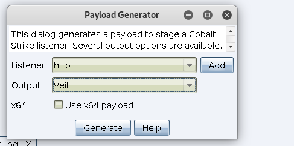
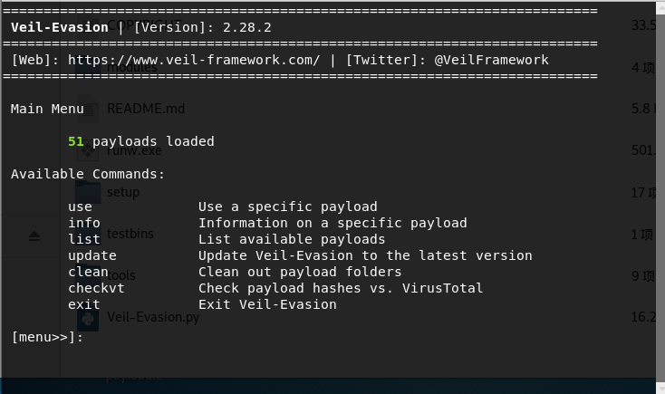
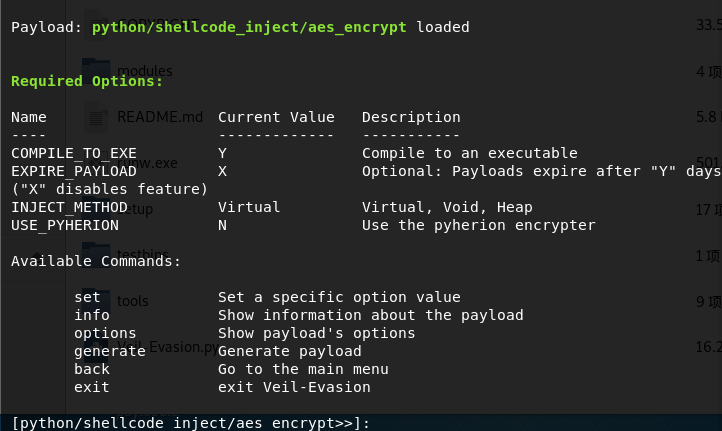
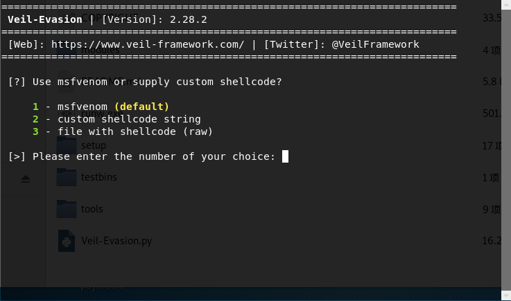

# 0x00 简介

AV查杀有几种方式:文件,内存，流量，行为。

以下文章基本都是做的比较简单的免杀,同时CS包含的其他模块可能被杀，我们有几种简单的思路,就不涉及什么定位特征码来做了。

1. 加壳

2. 多平台多语言生成shellcode

3. 加密shellcode 加载

4. 插入正常文件

5. 白名单加载

# 0x01 框架

这几款是比较热门的,但是感觉效果一般了。

1. Veil https://github.com/Veil-Framework/Veil

2. Phantom-Evasion  https://github.com/oddcod3/Phantom-Evasion

3. shellter  https://www.shellterproject.com/download/

4. avet  https://github.com/govolution/avet

总的来说支持msf的免杀框架都能用来免杀CS，因为他们的通讯是相通的，免杀msf用CS上线也是一样。

# 0x02 Veil

这里就拿Veil举例,因为Cobalt Strike生成的shellcode有支持他的，Veil的安装太繁琐了,各种出错，推荐使用docker 直接用。

>Attacks > Packages > Payload Generator

Veil-Evasion是veil 的老版本都一样

这里直接选择generate

输入2 自定义shellcode

然后把刚刚 `Payload Generator` 生成的veil shellcode 输入进去就OK了  工具还提供其他的payload加载方式，
免杀效果一般般吧 貌似window defender都过不了 ,人怕出名猪怕壮。

# 0x03 文末

不是很推荐用这类的框架，可以学习它的思路来自己写。

### 本文如有错误，请及时提醒，以免误导他人
