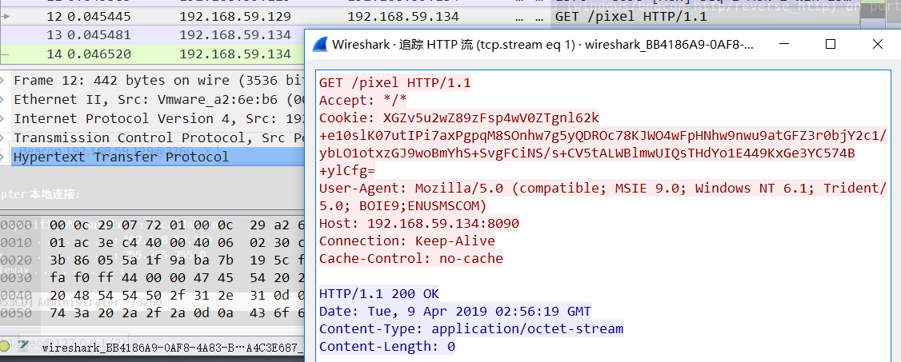
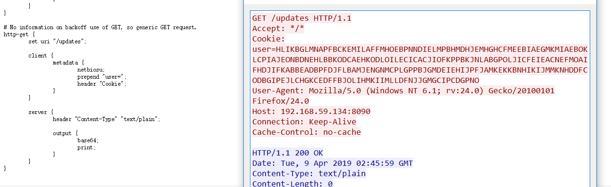
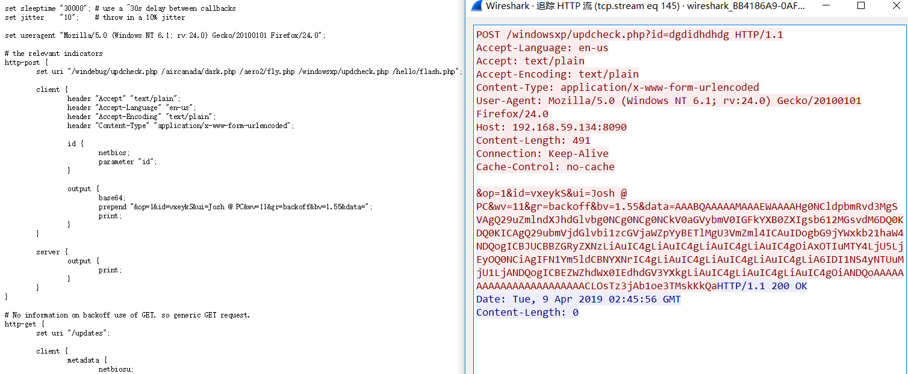

# 0x00 简介

Cobalt Strike的 Malleable-C2-Profiles 可以用来伪装流量,让我们的通讯更加隐蔽。

Beacon中的http通讯由Malleable-C2配置文件，在启动teamserver时来指定我们的配置文件,每个CS只能载入一个配置文件,多个文件需要启动多个teamserver

其中目录下的 `c2lint` 文件可以检测配置文件的语法问题和测试，官网建议在加载前都测试一下(废话)。


# 0x01 使用

运行脚本

```
./teamserver [external IP] [password] [/path/to/my.profile]

```

检测脚本

```

./c2lint [/path/to/my.profile]

```


在GitHub上给我们提供了许多写好的脚本 https://github.com/rsmudge/Malleable-C2-Profiles

我们选取一个来通过Wrueshark 抓包看看CS自带通讯特征



使用 `backoff.profile` 脚本后的GET,POST包






配合 `backoff.profile` 不难看出它的原理。


# 0x02 文末


### 本文如有错误，请及时提醒，以免误导他人