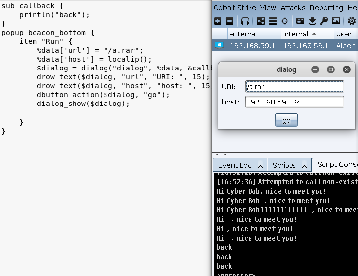

# 0x00 菜单

本文有很多Function来自官网文档https://www.cobaltstrike.com/aggressor-script/functions.html 

在旧菜单中添加一个新的条目以菜单 help为例 打开help 选择new 浏览器打开网址

```
popup help {
    item("&new",{url_open("https://www.baidu.com");});

}

```

构建子菜单 new 选项下面再有2个条目

```
popup help {
    menu "&new" {
        item "one" {url_open("https://www.baidu.com");}
        item "two" {url_open("https://www.baidu.com");}
    }
}


```


beacon右键菜单

beacon_bottom是右键菜单的名字

```
popup beacon_bottom {
    item "Run" {url_open("https://www.baidu.com");}
}

```

# 0x01 窗口


### 询问用户文本的对话框 prompt_text

弹出窗口的构建用到函数 `prompt_text` ,他给我们提供三个参数 

$1-对话框中的文本。
$2-文本字段中的默认值。
$3—回调函数。当用户按OK时调用。此回调的第一个参数是用户提供的文本。

```
popup beacon_bottom {
    item "Run" {
        prompt_text("What is your name?", "Cyber Bob", {
            println("Hi $1  , nice to meet you!");
            });
    }
}
prompt_text($1,$2,$3);

```

### 对话框 dialog

使用 `dialog` 我们一般配合这几个函数 `drow_text` `dialog_show` `dbutton_action`


##### dialog

参数：
$1- 对话框的标题
$2- 将名称映射为默认值的％字典
$3- 回调函数，当用户按下`＆dbutton_action` 按钮时调用，$1是对话框的引用。$2是按钮名称，$3是一个字典，将每行的名称映射到其值。

##### drow_text

将文本字段行添加到`&dialog`

参数：
$1- $dialog对象
$2- 此行的名称
$3- 标签
$4- 可选,此文本字段的宽度。

##### dialog_show

显示 &dialog.

参数
$1 - $dialog对象

####  dbutton_action
向对话框添加操作按钮,按下此按钮时，对话框将关闭并调用其回调。
您可以在对话框中添加多个按钮。Cobalt Strike会将这些按钮排成一行，并将它们置于对话框的底部。

参数
$1- $dialog对象
$2- 按钮标签


举个简单的例子

```
sub callback { 
    println("back");
} 
popup beacon_bottom {
    item "Run" {
        %data['url'] = "/a.rar";
        %data['host'] = localip();
        $dialog = dialog("dialog", %data, &callback);
        drow_text($dialog, "url", "URI: ", 15);
        drow_text($dialog, "host", "host: ", 15);
        dbutton_action($dialog, "go");
        dialog_show($dialog);

    }
}

```




# 0x02 文末

简单的介绍了几个函数，更多请阅读官方文档


### 本文如有错误，请及时提醒，以免误导他人