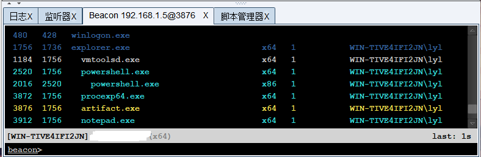
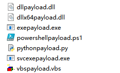
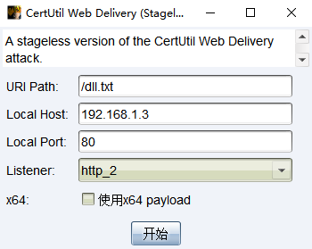
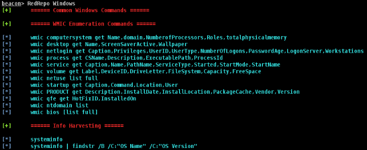
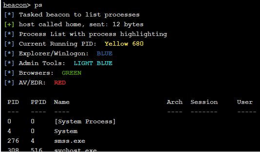
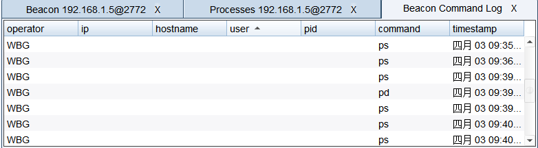
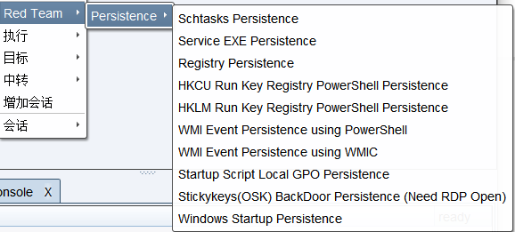
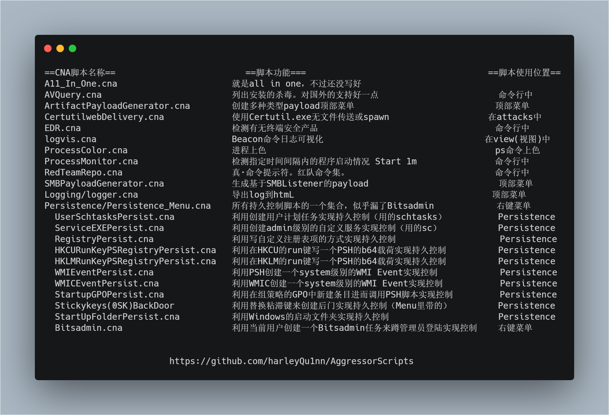
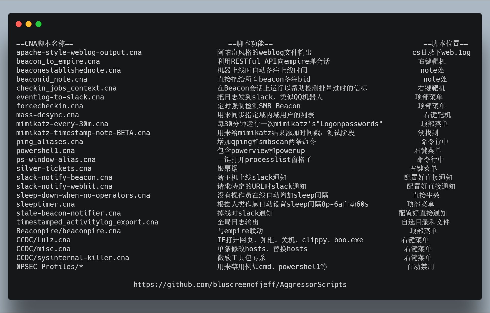

# 0x00 简介

Aggressor Script是Cobalt Strike 3.0版及更高版本中内置的脚本语言，可以修改和扩展Cobalt Strike客户端。
Aggressor Script遵循Sleep Scripting Language语法http://sleep.dashnine.org/manual

# 0x01 使用

> view ->Script Console

当然你也可以在 Cobalt Stike > script Manager 来操作管理

输入help 内置几个命令如下

Command| Arguments  |  What it does
-| -| -| 
?   | "*foo*" iswm "foobar"   | evaluate a sleep predicate and print result
e   | println("foo");  |evaluate a sleep statement
help   |   null   | list all of the commands available
load    | /path/to/script.cna  | load an Aggressor Script script
ls      | list all of the scripts  |loaded
proff   | script.cna  | disable the Sleep profiler for the script
profile | script.cna   | dumps performance statistics for the script.
pron    | script.cna  | enables the Sleep profiler for the script
reload  | script.cna  | reloads the script
troff   | script.cna   | disable function trace for the script
tron   |  script.cna  | enable function trace for the script
unload  | script.cna  | unload the script
x   | 2 + 2   | evaluate a sleep expression and print result

`Load `加载脚本
`Unload` 卸载脚本
`Reload` 重新加载脚本

# 0x02 推荐脚本

以下内容来自https://wbglil.gitbooks.io/cobalt-strike/cobalt-strikejiao-ben-shi-yong.html
感谢大佬同意（这章脚本推荐实在是非常麻烦）

1.

脚本名称：ProcessTree.cna

脚本功能：让ps命令可以显示父子关系并显示颜色

2.

脚本名称：ArtifactPayloadGenerator.cna+

脚本功能：创建多种类型的payload。生成的文件在cs目录下的opt\cobaltstrike\

3.

脚本名称：AVQuery.cna

脚本功能：查询目标所安装的所有杀软

4.

脚本名称：CertUtilWebDelivery.cna
脚本功能：利用CertUtil和rundll32生成会话这个应该都知道了解

5.

脚本名称：RedTeamRepo.cna
脚本功能：就是提示一下常用的渗透命令

6.

脚本名称：ProcessColor.cna
脚本功能：显示带有颜色的进程列表(不同颜色有不同含义)

7.

脚本名称：EDR.cna
脚本功能：检查有无终端安全产品

8.

脚本名称：logvis.cna
脚本功能：显示Beacon命令日志

9.

脚本名称：ProcessMonitor.cna
脚本功能：记录一段时间内程序启动的情况

10.

脚本名称：SMBPayloadGenerator.cna
脚本功能：生成基于SMB的payload

11.
 

脚本名称：Persistence/Persistence_Menu.cna
脚本功能：持久化控制集合
备注:这个脚本是同目录脚本的一个集合

12.

脚本名称：Eternalblue.cna
脚本功能：ms17-010
https://gist.github.com/rsmudge/9b54a66744a94f3950cc171254057942
备注：调用exploit/windows/smb/ms17_010_eternalblue

----------

更多:https://mp.weixin.qq.com/s/CEI1XYkq2PZmYsP0DRU7jg
个人认位这位老哥整理的已经很全面了，象征性发一些

----------

13.

https://github.com/harleyQu1nn/AggressorScripts

14.

https://github.com/bluscreenofjeff/AggressorScripts

脚本来源：
https://github.com/rsmudge/ElevateKit
https://github.com/vysec/CVE-2018-4878
https://github.com/harleyQu1nn/AggressorScripts
https://github.com/bluscreenofjeff/AggressorScripts
https://github.com/ramen0x3f/AggressorScripts
https://github.com/360-A-Team/CobaltStrike-Toolset
https://github.com/ars3n11/Aggressor-Scripts
https://github.com/michalkoczwara/aggressor_scripts_collection
https://github.com/vysec/Aggressor-VYSEC
https://github.com/killswitch-GUI/CobaltStrike-ToolKit
https://github.com/ZonkSec/persistence-aggressor-script
https://github.com/ramen0x3f/AggressorScripts
https://github.com/rasta-mouse/Aggressor-Script
https://github.com/RhinoSecurityLabs/Aggressor-Scripts
https://github.com/Und3rf10w/Aggressor-scripts
https://github.com/Kevin-Robertson/Inveigh
https://github.com/Genetic-Malware/Ebowla
https://github.com/001SPARTaN/aggressor_scripts
https://github.com/gaudard/scripts/tree/master/red-team/aggressor
https://github.com/branthale/CobaltStrikeCNA
https://github.com/oldb00t/AggressorScripts
https://github.com/p292/Phant0m_cobaltstrike
https://github.com/p292/DDEAutoCS
https://github.com/secgroundzero/CS-Aggressor-Scripts
https://github.com/skyleronken/Aggressor-Scripts
https://github.com/tevora-threat/aggressor-powerview
https://github.com/tevora-threat/PowerView3-Aggressor
https://github.com/threatexpress/aggressor-scripts
https://github.com/threatexpress/red-team-scripts
https://github.com/threatexpress/persistence-aggressor-script
https://github.com/FortyNorthSecurity/AggressorAssessor
https://github.com/mdsecactivebreach/CACTUSTORCH
https://github.com/C0axx/AggressorScripts
https://github.com/offsecginger/AggressorScripts
https://github.com/tomsteele/cs-magik
https://github.com/bitsadmin/nopowershell
https://github.com/SpiderLabs/SharpCompile
https://github.com/SpiderLabs/SharpCompile
https://github.com/realoriginal/reflectivepotato

# 0x02 文末

感谢上面两位大佬的整理，确实幸苦。

### 本文如有错误，请及时提醒，以免误导他人