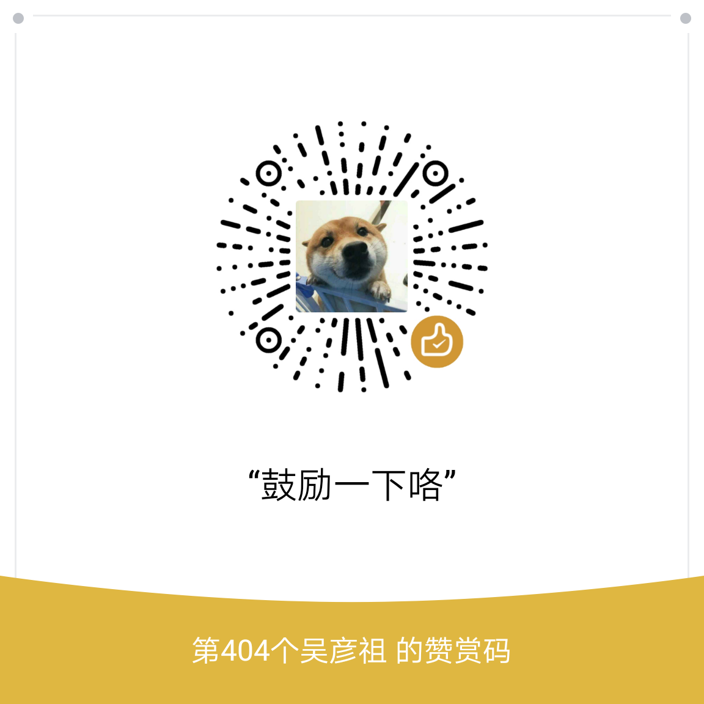

# _Cobalt Strike_ 

待更新（还有部分）
----------

最近逛了不少论坛，发现大家对Cobalt Strike的热情很高，不得不承认这款软件是后渗透神器，其中的东西很值得大家借鉴，其实貌似在2015年作者在油管上传了关于Cobalt Strike 视频，囊括了这个神器的基本功能，同时也解说了其中的原理，网上也有翻译过来的字幕，但是感觉视频看起来还是不是很舒服，于是自己写下Cobalt Strike的系列教程，免费发布出来。Micro8大佬写的教程开了个好头，相信后面大家也能更愿意分享出来，闭门造车感觉提升永远是有限的，只有不断的交流才能获得提高。怎么说呢，知识付费这个事情没什么问题，但是我还是希望大家能分享。


文章中会有些文笔错误，或者上技术的错误，希望大家看到能指出，文章的方向大概是

```
功能翻译 ->特殊beacon - >钓鱼 ->beacon部分功能介绍 ->免杀 ->脚本编写 -> 通讯隐蔽 -> 其他
```
----------

这个教程的目的是让大家一起熟练红队工具的使用 。写文章是一个自我提高的过程，文章我喜欢穿插一些内容写出来，可能结构上有点不合理。一个人写文章其实也挺累的，身体才是革命的本钱，还是那句话多喝热水。同时通过这个也想认识些喜欢开源，分享的志同道合的朋友，能在空闲时间分享一些自己的知识。


本人撰写的文章，仅供学习和研究使用，请勿使用文中的技术源码用于非法用途，任何人造成的任何负面影响，与本人无关。


