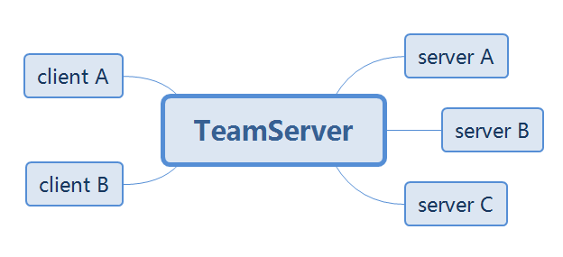
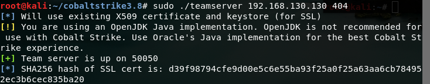
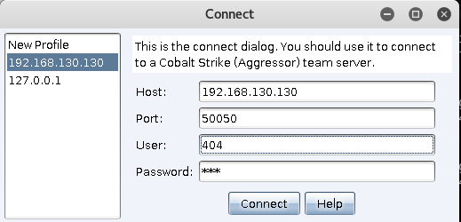
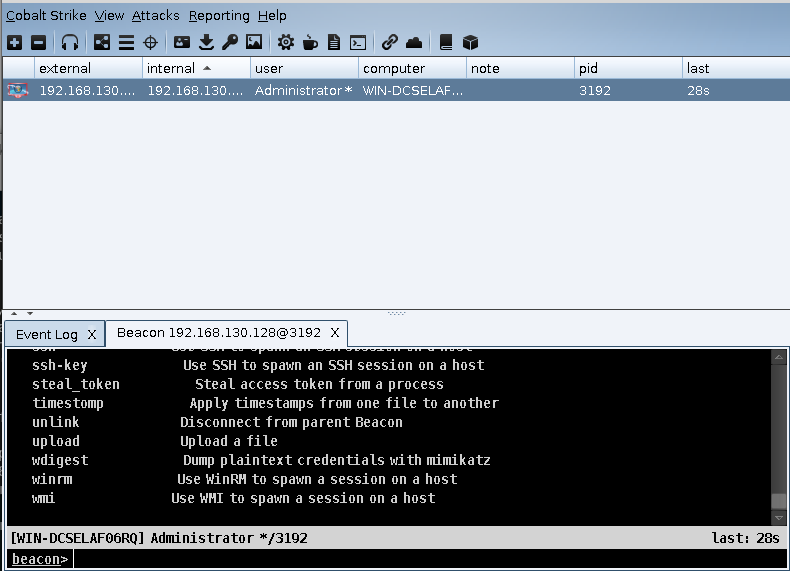
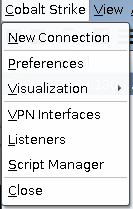
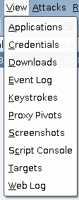
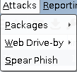
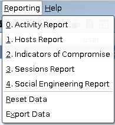
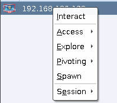

# 0x00 简介

>Cobalt Strike是一款常用于后渗透的神器，这个工具以团队作为主体，共享信息，拥有多种协议上线方式，集成了端口转发，端口扫描，socket代理，提权，钓鱼等。除去自身功能外，Cobalt Strike还利用了Metasploit和Mimikatz等其他知名工具的功能。

# 0x01 Cobalt Strike 架构



## 文件结构
```
│  agscript 拓展应用的脚本
│  c2lint  检查profile的错误异常
│  cobaltstrike
│  cobaltstrike.jar 客户端程序
│  icon.jpg
│  license.pdf
│  readme.txt
│  releasenotes.txt
│  teamserver  服务端程序
│  update
│  update.jar
│
└─third-party 第三方工具
        README.vncdll.txt
        vncdll.x64.dll
        vncdll.x86.dll
```

## 个人定制

* Cobalt Strike可以使用 AggressorScripts脚本来加强自身，能够扩展菜单栏，Beacon命令行，提权脚本等

* Cobalt Strike通信配置文件是 Malleable C2 你可以修改 CS的通讯特征，Beacon payload的一些行为
 
* Cobalt Strike可以引用其他的通讯框架ExternalC2，ExternalC2是由Cobalt Strike提出的一套规范/框架，它允许黑客根据需要对框架提供的默认HTTP(S)/DNS/SMB C2 通信通道进行扩展。

总的来说 CS的自定义功能很强大，使用起来很灵活后期，会讲到相关的使用。

# 0x02 运行

Cobalt Strike 需要团队服务器才能使用，也就是teamserver。 需要文件 teamserver 与 cobaltstrike.jar 可以选择把他放在公网上面

## 启动团队服务器

```
执行 sudo ./teamserver
```

```
./teamserver <host> <password> [/path/to/c2.profile] [YYYY-MM-DD]

	<host> is the (default) IP address of this Cobalt Strike team server
	<password> is the shared password to connect to this server
	[/path/to/c2.profile] is your Malleable C2 profile
	[YYYY-MM-DD] is a kill date for Beacon payloads run from this server
```
在没有使用 自己的Malleable C2 profile情况下只填host 与 password即可



启动CS  ./cobaltstrike.jar



其中user就是你想要输入的名字，password 为启动teamserver的密码



进入主文件

# 0x03 菜单栏功能

## Cobalt Strike


```
New Connection  //新的链接
Preferences 偏好设置
Visualization  窗口视图模式
VPN interfaces  VPN接入
Listeners  监听器
Sript Manager  脚本管理
Close 退出
```
其中 Preferences 可以删除 登陆记录的账户密码 与team server SSL ，其他的就是软件的一些颜色等。

##  View


```
Applications 用于显示 System Profiler 获取的目标浏览器，操作系统，flash版本
Credentials 显示所有已经获取的用户主机hash
Downloads 显示下载的文件
Event log 事件日志 记录团队  目标上线等记录
Keystrokes 目标键盘记录
Proxy Pivots 代理信息
Screenshots 屏幕截图
Script Console 加载自定义脚本
Targets 显示所有主机
Web log web服务日志
```

## Attack


```
Packages
HTML Application 生成hta文件
MS Office Macro  宏office文件
Payload Generator  生成各种语言版本的payload
USB/CD AutoPlay 利用自动播放运行的被控端文件
Windows Dropper 捆绑器可将任意正常的文件
Windows Executable payload生成可执行文件 (一般使用这个)
Windows Executable (S)  把包含payload,Stageless生成可执行文件(包含多数功能)
```

```
Web Drive-by 
Manage  开启的所有web服务
Clone Site 克隆网站 
Host File 提供Web以供下载某文件
Scripted Web Delivery  为payload提供web服务以便于下载和执行
Signed Applet Attack  启动一个Web服务以提供自签名Java Applet的运行环境
Smart Applet Attack  自动检测Java版本并l利用已知的exploits绕过security
System Profiler 获取系统，Flash，浏览器版本等
```

```
Spear Phish 鱼叉式网络钓鱼
```

## Reporting

```
Activity report  活动报告
Hosts report  主机报告
Indicators of Compromise 威胁报告
Sessions report  会话报告
Social engineering report  社会工程学报告
```

# 0x04 右键功能


```
Interact 打开beacon
Access 
	dump hashes 获取hash
	Elevate  提权
	Golden Ticket 生成黄金票据注入当前会话
	MAke token  凭证转换
	Run Mimikatz 运行 Mimikatz 
	Spawn As 用其他用户生成Cobalt Strike侦听器
Explore
	Browser Pivot 劫持目标浏览器进程
	Desktop(VNC)  桌面交互
	File Browser  文件浏览器
	Net View 命令Net View
	Port scan 端口扫描
	Process list 进程列表
	Screenshot 截图
Pivoting
	SOCKS Server 代理服务
	Listener  反向端口转发
	Deploy VPN 部署VPN
Spawn  新的通讯模式并生成会话
Session 会话管理，删除，心跳时间，退出，备注
```

# Beacon

```
beacon> help

Beacon Commands
===============

    Command                   Description
    -------                   -----------
    browserpivot              Setup a browser pivot session
    bypassuac                 Spawn a session in a high integrity process
    cancel                    Cancel a download that's in-progress
    cd                        Change directory
    checkin                   Call home and post data
    clear                     Clear beacon queue
    covertvpn                 Deploy Covert VPN client
    cp                        Copy a file
    dcsync                    Extract a password hash from a DC
    desktop                   View and interact with target's desktop
    dllinject                 Inject a Reflective DLL into a process
    download                  Download a file
    downloads                 Lists file downloads in progress
    drives                    List drives on target
    elevate                   Try to elevate privileges
    execute                   Execute a program on target
    exit                      Terminate the beacon session
    getsystem                 Attempt to get SYSTEM
    getuid                    Get User ID
    hashdump                  Dump password hashes
    help                      Help menu
    inject                    Spawn a session in a specific process
    jobkill                   Kill a long-running post-exploitation task
    jobs                      List long-running post-exploitation tasks
    kerberos_ccache_use       Apply kerberos ticket from cache to this session
    kerberos_ticket_purge     Purge kerberos tickets from this session
    kerberos_ticket_use       Apply kerberos ticket to this session
    keylogger                 Inject a keystroke logger into a process
    kill                      Kill a process
    link                      Connect to a Beacon peer over SMB
    logonpasswords            Dump credentials and hashes with mimikatz
    ls                        List files
    make_token                Create a token to pass credentials
    mimikatz                  Runs a mimikatz command
    mkdir                     Make a directory
    mode dns                  Use DNS A as data channel (DNS beacon only)
    mode dns-txt              Use DNS TXT as data channel (DNS beacon only)
    mode dns6                 Use DNS AAAA as data channel (DNS beacon only)
    mode http                 Use HTTP as data channel
    mode smb                  Use SMB peer-to-peer communication
    mv                        Move a file
    net                       Network and host enumeration tool
    note                      Assign a note to this Beacon       
    portscan                  Scan a network for open services
    powerpick                 Execute a command via Unmanaged PowerShell
    powershell                Execute a command via powershell.exe
    powershell-import         Import a powershell script
    ppid                      Set parent PID for spawned post-ex jobs
    ps                        Show process list
    psexec                    Use a service to spawn a session on a host
    psexec_psh                Use PowerShell to spawn a session on a host
    psinject                  Execute PowerShell command in specific process
    pth                       Pass-the-hash using Mimikatz
    pwd                       Print current directory
    rev2self                  Revert to original token
    rm                        Remove a file or folder
    rportfwd                  Setup a reverse port forward
    runas                     Execute a program as another user
    runu                      Execute a program under another PID
    screenshot                Take a screenshot
    shell                     Execute a command via cmd.exe
    shinject                  Inject shellcode into a process
    shspawn                   Spawn process and inject shellcode into it
    sleep                     Set beacon sleep time
    socks                     Start SOCKS4a server to relay traffic
    socks stop                Stop SOCKS4a server
    spawn                     Spawn a session 
    spawnas                   Spawn a session as another user
    spawnto                   Set executable to spawn processes into
    spawnu                    Spawn a session under another PID
    ssh                       Use SSH to spawn an SSH session on a host
    ssh-key                   Use SSH to spawn an SSH session on a host
    steal_token               Steal access token from a process
    timestomp                 Apply timestamps from one file to another
    unlink                    Disconnect from parent Beacon
    upload                    Upload a file
    wdigest                   Dump plaintext credentials with mimikatz
    winrm                     Use WinRM to spawn a session on a host
    wmi                       Use WMI to spawn a session on a host
```
此部分不做翻译 讲在后期使用中介绍 也可在Beacon 使用`help xxxx`获取更加详细的介绍
(翻译太累了=.=)

# 0x06文末
本文介绍Cobalt Strike3.8版本的运行以及大体功能的翻译，后期功能演示可能会换成其他版本。（本文用时3个小时）


### 本文如有错误，请及时提醒，以免误导他人