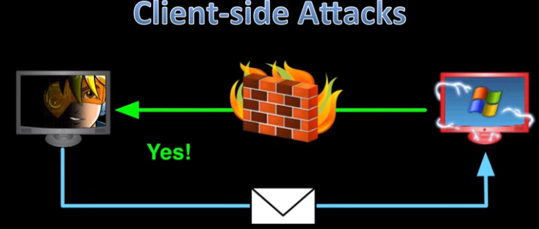
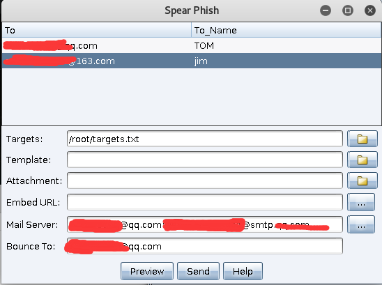
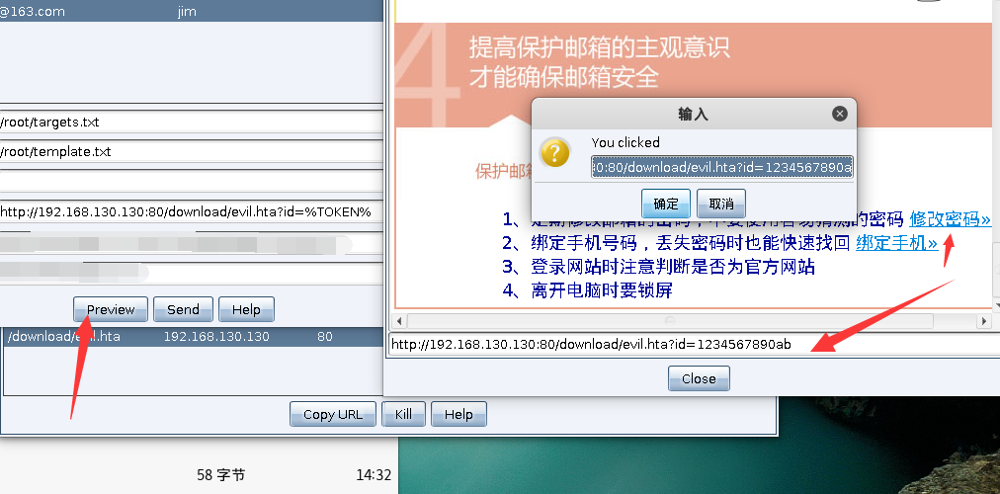
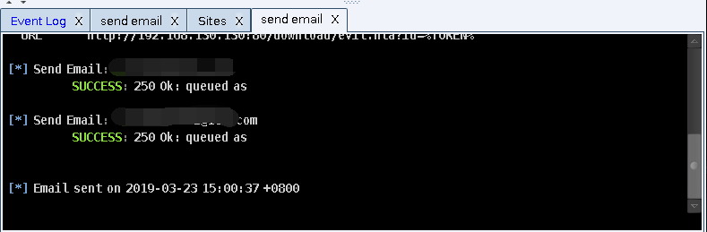
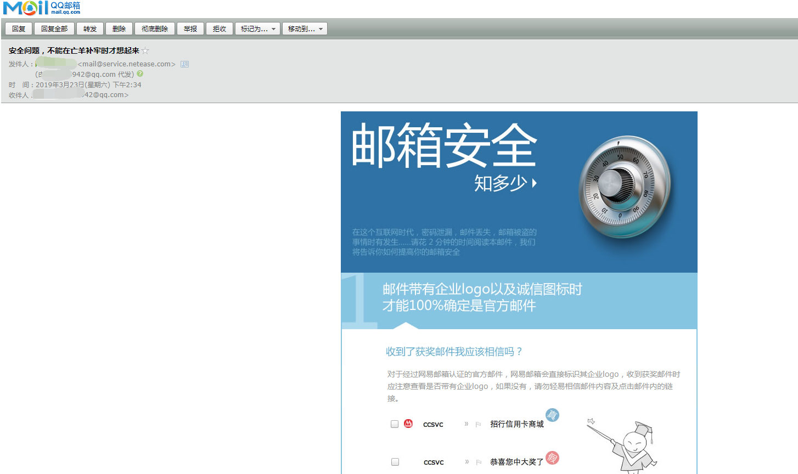

# 0x00 简介
本章介绍的是Spear Phish（鱼叉式网络钓鱼）在Cobalt Strike中给我们提供了 鱼叉邮件的功能 ,配上host file 等实现，进一步攻击。


往往我们不能直接入手的时候，鱼叉邮件是一种不错的手段，我们可以在APT攻击上经常看到他的身影

# 0x01 Spear Phish 配置

>使用 Attack>Spear Phish



* targets 发送的目标信息 格式 xxxx@xxx.com(tab键) name

```
55x@qq.com	TOM
xx@163.com	jim

```
* tmplate 邮件模板 一般在邮件的更多选项中 ，选择导出，或者显示原文

* attachment 附件 

* Embed URL 要嵌入的网址

* Mail server  SMTP 

* Bounce to 模仿发件人



preview 预览我们的模板文件 在实际操作过程中 当然是先给自己发一封



send发送成功后我们可以在 send email 看到提示

对应 目标收到的效果图

# 0x02 文末

本文略短 灵活配合其他钓鱼手法，比如这里的Embed URL 可以换成上一章的flash oday 达到打开网址获得权限（半小时）

### 本文如有错误，请及时提醒，以免误导他人
