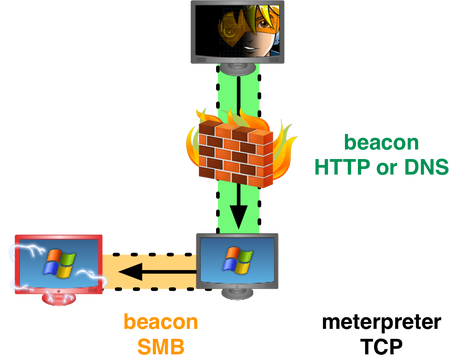
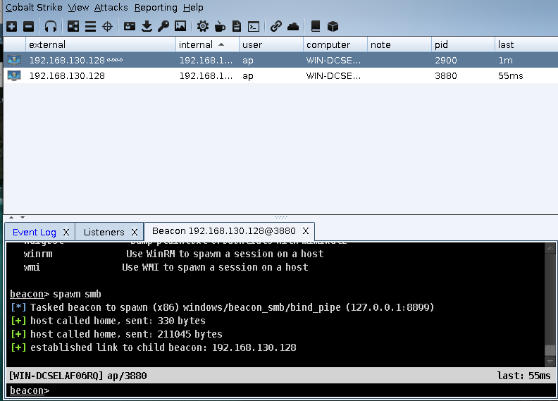
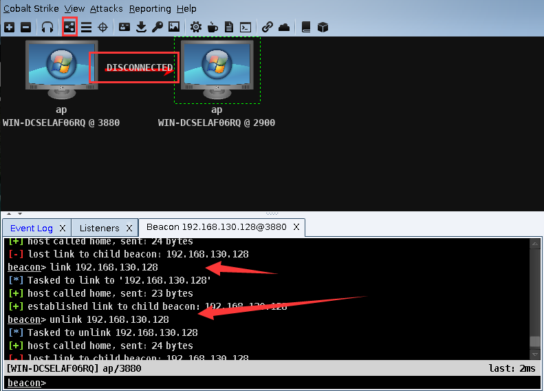
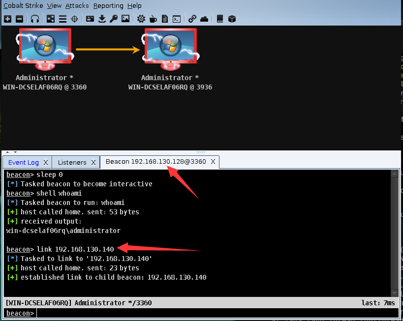
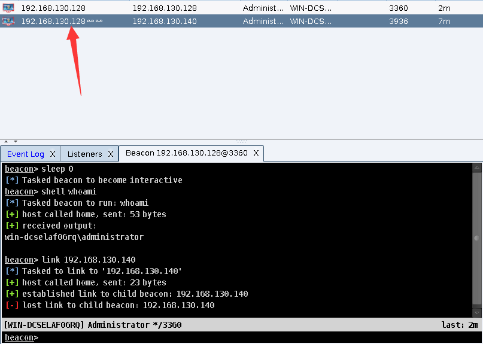

# 0x00 SMB Beacon简介

为什么要把这个监听器单独的拿出来呢，因为它跟DNS beacon都比较特殊，可能在防护墙绕过会用到它。[官网](https://www.cobaltstrike.com/help-smb-beacon )这么介绍它的SMB Beacon使用命名管道通过父级Beacon进行通讯，当两个Beacons链接后，子Beacon从父Beacon获取到任务并发送。因为链接的Beacons使用Windows命名管道进行通信，此流量封装在SMB协议中，所以[SMB Beacon](https://blog.cobaltstrike.com/2013/12/06/stealthy-peer-to-peer-cc-over-smb-pipes/)相对隐蔽。


其中它的原理图我引用作者的博客找到一张图




# 0x01 SMB Beacon使用

这种方法有几个注意事项：
1.具有SMB Beacon的主机必须接受端口445上的连接。
2.只能链接由同一Cobalt Strike实例管理的Beacon。

* 派生一个 SMB Beacon
在 Listeners 生成 SMB Beacon >目标主机>右键>spawn>选中Listeners >choose



运行成功后 external 可以看到 ∞∞ 这个字符 ，这就是派生的SMB Beacon
当前是连接状态 你可以主Beacon上 用link host链接它 或者unlink host断开它 。



点击上面的小图标出现透视图，当用命令断开时 链接符号上面出现disconnected

* 内网横向渗透 SMB
至于内网横向渗透我这里就不讲了 可以使用ipc$ 什么的生成的 SMB Beacon上次到目标主机执行，然后这里是不会直接上线的，需要我们自己用link命令去连接他。
**环境**:
windows 7
windows 7
这里直接克隆的win7两台所以图片主机名一样的




第一个原理图已经完美说明了这两幅图的连接方式


# 0x02 Spawn

我们在 beacon 运行 help spawn 可以看到它的具体方法

```
beacon> help spawn
Use: spawn [x86|x64] [listener]
     spawn [listener]

Spawn an x86 or x64 process and inject shellcode for the listener.
```

spawn 这个功能，中文意思是“产卵”，它的功能就是可以派生出更多的Beacon 让一个团队分布式渗入。通常我们在团队主服务器上给队友来派生Beacon 这样只要主服务器权限不掉，还能继续操作。尽量派生出多个Beacon，让我们的操作都在子Beacon。

这里我简单叙述下 如何操作从主服务器 派生到 其他队友服务器过程

```
队友服务器Listeners生成 > 团队服务器 Listeners生成 使用队友ip>Spawn
```
其实很好理解 就是让队友的服务器生成监听 然后团队服务器生成server ip指向队友。

灵活的运用Spawn 不仅可以使团队效率提高，也能较好的维持权限，同时还能结合MSF。


# 0x03 文末
DNS和SMB 都是CS比较不错的Listeners。(用时3小时)

### 本文如有错误，请及时提醒，以免误导他人
