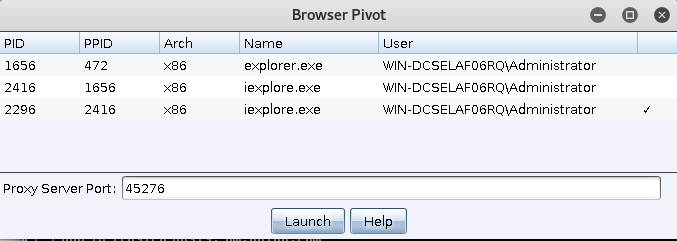
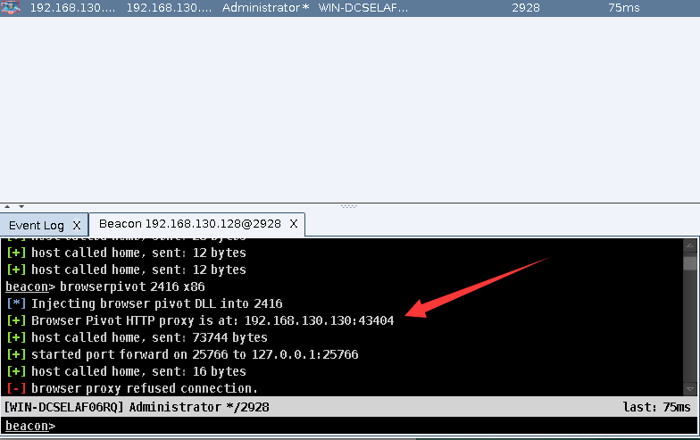
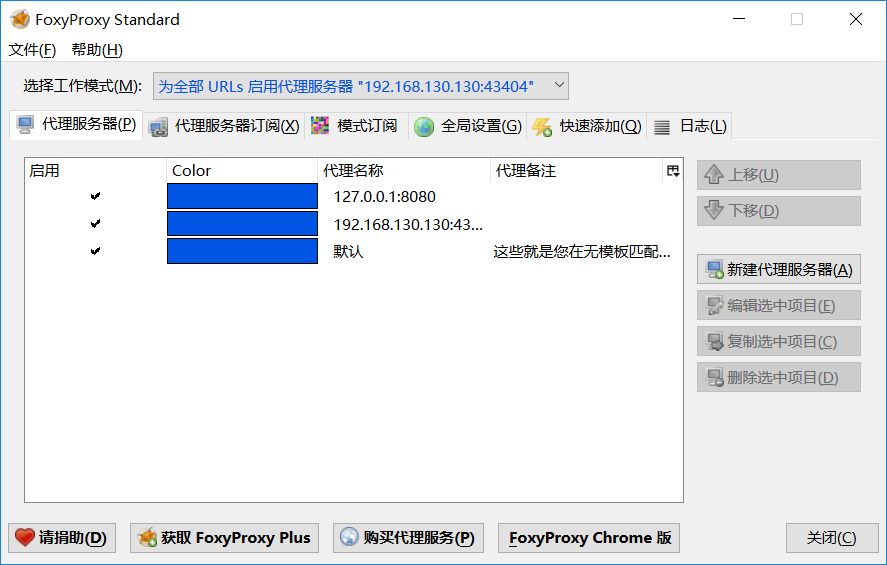
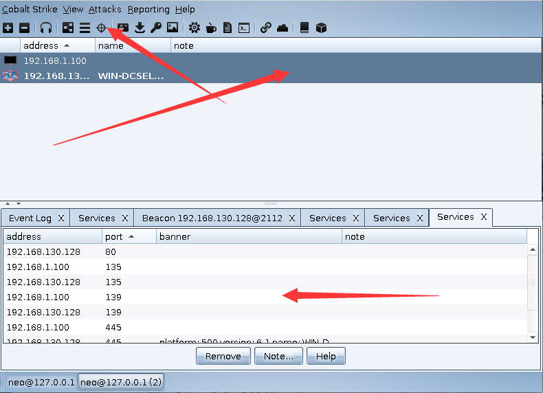
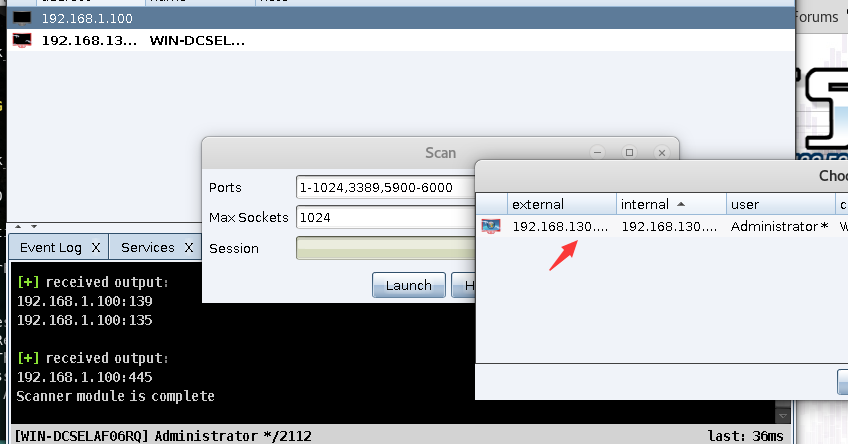

# 0x00 Browser Pivoting

Browser Pivoting 的功能事劫持目标的WEB会话，浏览此代理服务器时，将保存cookie信息，验证HTTP会话身份和客户端SSL证书。

beacon 命令行

```
beacon> help browserpivot
Use: browserpivot [pid] [x86|x64]
     browserpivot [stop]

Setup a Browser Pivot into the specified process. To hijack authenticated
web sessions, make sure the process is an Internet Explorer tab. These
processes have iexplore.exe as their parent process.

Use "browserpivot stop" to tear down the browser pivoting sessions 
associated with this Beacon.

```

>或者使用 目标右键 > Explore   > Browser Pivot 



选择你要注入的进程



然后在浏览器设置代理，访问网址



目标关闭正在使用的选项卡，则需要重新注入browser pivoting代理服务器。

# 0x01 Port Scan

命令行

```
Use: portscan [targets] [ports] [arp|icmp|none] [max connections]

Launches a port scan against the specified hosts. 

[targets] is a comma separated list of hosts to scan. You may also specify
IPv4 address ranges (e.g., 192.168.1.128-192.168.2.240, 192.168.1.0/24)

[ports] is a comma separated list or ports to scan. You may specify port
ranges as well (e.g., 1-65535)

The [arp|icmp|none] options dictate how the port scanning tool will determine
if a host is alive. The ARP option uses ARP to see if a system responds to the
specified address. The ICMP option sends an ICMP echo request. The none option 
tells the portscan tool to assume all hosts are alive.

The [max connections] option limits how many connections the port scan tool
will attempt at any one time. The portscan tool uses asynchronous I/O and
it's able to handle a large number of connections at one time. A higher value
will make the portscan go much faster. The default is 1024.
```


1. arp方法使用ARP请求来发现主机是否处于存活状态。
2. icmp方法发送ICMP echo请求来检查目标是否处于存活状态。
3. none选项告诉portscan工具假定所有主机都处于存活状态


>使用  目标右键 > Explore > port scan


可以选择网段、协议、以及最大链接数



扫描完成后我们可以在第三个视图看打我们的扫描结果，多选或者单选 右键 > Services 看到我们的扫描结果。



也可以通过右键 Scan 选择一个主机对他重扫描 none选项。

# 0x02 文末

一章讲一个功能感觉有点因此结合一下，第三个视图也是我们横向渗透经常用到的。

### 本文如有错误，请及时提醒，以免误导他人

