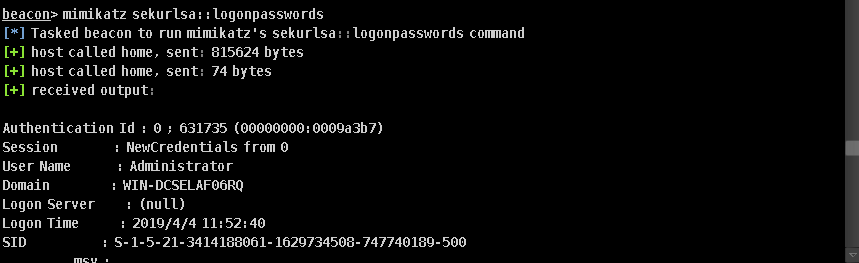
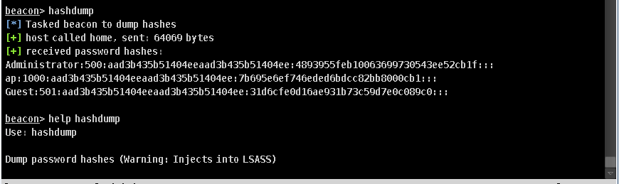
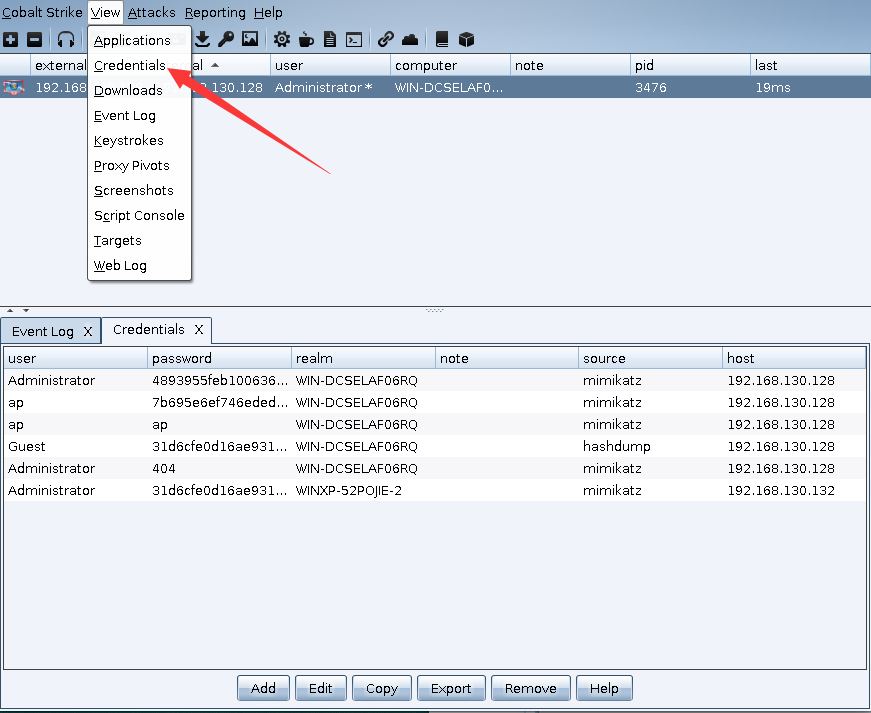

# 0x00 mimikatz

就是个mimikatz 用法跟网上一样，这个神器就不多多说了抓密码创建票证等等

```
beacon> help mimikatz
Use: mimikatz [module::command] <args>
     mimikatz [!module::command] <args>
     mimikatz [@module::command] <args>

Runs a mimikatz command. 

Use ! to make mimikatz elevate to SYSTEM before it runs your command. Some
commands require this.

Use @ to make mimikatz impersonate Beacon's thread token before it runs your
command. This is helpful for mimikatz commands that interact with remote
systems (e.g., lsadump::dcsync)

```


其中beacon内置的命令 `logonpasswords` 就是mimikatz的 `sekurlsa::logonpasswords full`  



当系统为win10或2012R2以上时，默认在内存缓存中禁止保存明文密码，密码字段显示为null，需要修改注册表等用户重新登录后才能成功抓取。


# 0x01 hashdump


```
beacon> help hashdump
Use: hashdump

Dump password hashes (Warning: Injects into LSASS)

```




当然我们也可以用 利用procdump把lsass进程的内存文件导出本地，本地mimikatz读取密码，在网上有前辈们总结出来的很多方法，按照情况选择。
到这一章节我们也逐渐向内网迈进了。

获取密码的密码在credentials记录起来

> view > credentials




# 0x02 黄金票据

Cobalt Strike 设置黄金票据其实就是调用的mimikatz

>目标右键 > Access > Golden Ticke


# 0x03 文末

密码搜集是我们内网的重要步骤

### 本文如有错误，请及时提醒，以免误导他人

