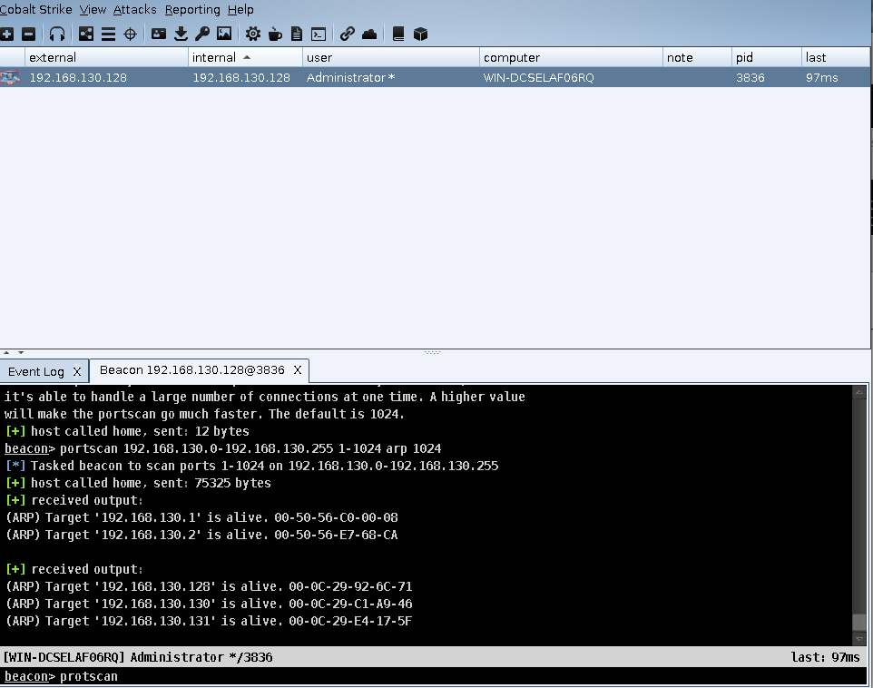
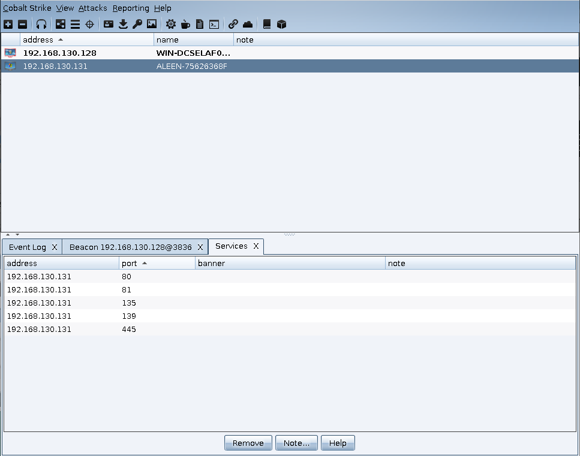
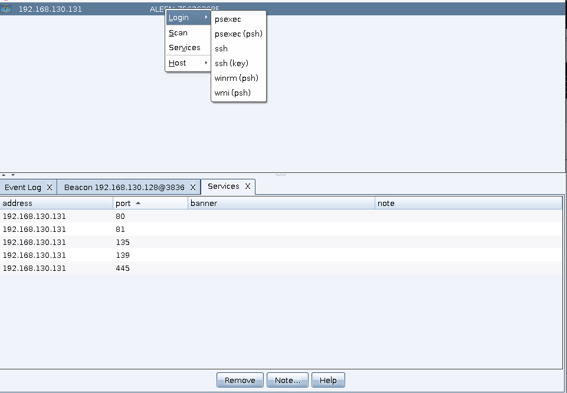
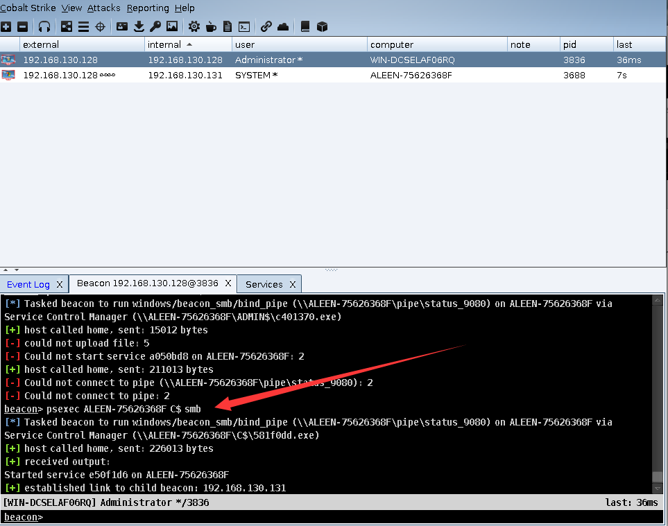
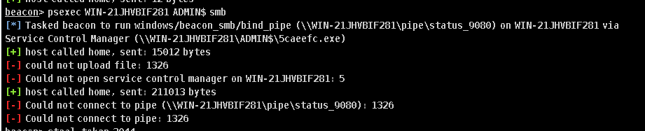
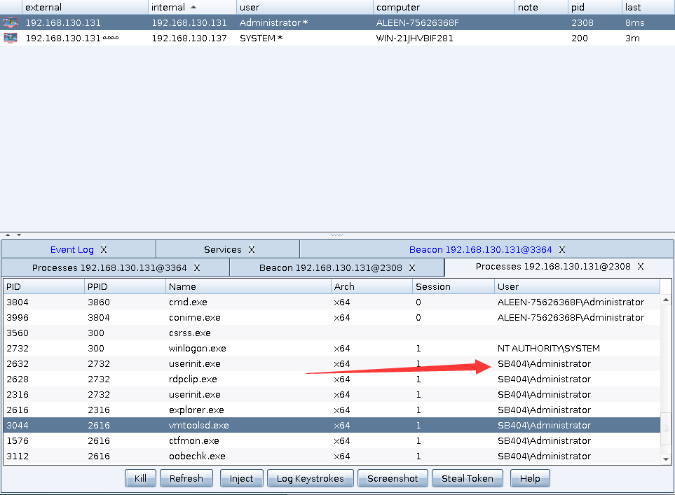
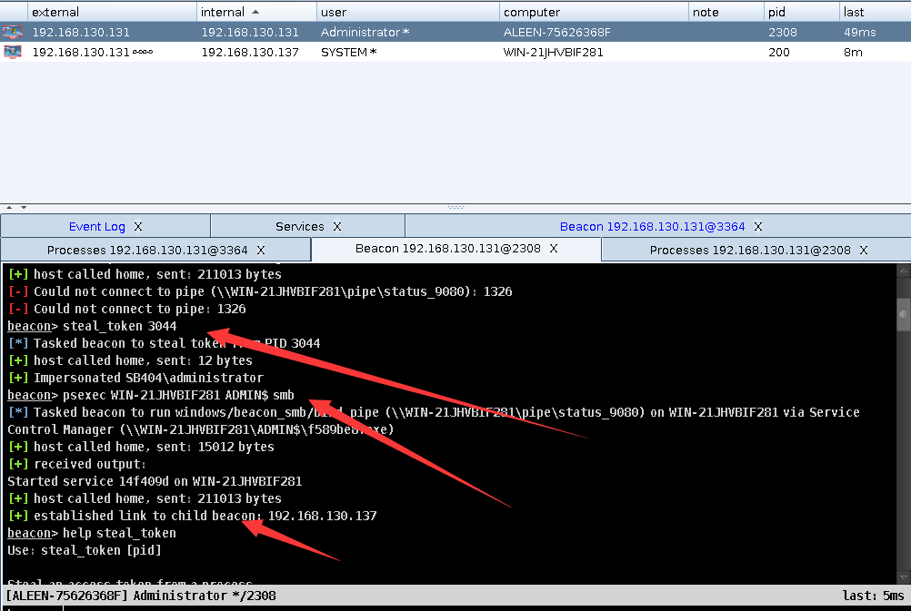
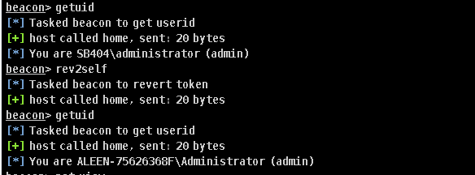

# 0x00 简介

横向渗透中Cobalt Strike给我们提供了 `psexec` `win` `winrm` 但是只是部分功能
顺便介绍下这几个工具。

### psexec

>1、通过ipc$连接，然后释放psexesvc.exe到目标机器。
2、通过服务管理SCManager远程创建psexecsvc服务，并启动服务。
3、客户端连接执行命令,服务端启动相应的程序并执行回显数据。

Cobalt Strike 中提供2种psexec 用法

```
beacon> help psexec
Use: psexec [host] [share] [listener]

Spawn a session on a remote host. This command generates an executable, copies
it to the target, creates a service to run it, and cleans up after itself. You
must specify which share (e.g., ADMIN$ or C$) to copy the file to.
```

```
beacon> help psexec_psh
Use: psexec_psh [host] [listener]

Spawn a session on a remote host. This command creates a service on the target
to start a PowerShell one-liner to bootstrap the desired listener.

```

一种是用psexec生成会话 一种是利用psexec和powershell生成 psh都与powershell有关。


### WMI 

>WMI的全称是 Windows Management Instrumentation,它出现在所有的 Windows 操作系统中，并由一组强大的工具集合组成，用于管理本地或远程的 Windows 系统,攻击者使用wmi来进行攻击,但Windows系统默认不会在日志中记录这些操作,可以做到无日志,攻击脚本无需写入到磁盘,增加了隐蔽性,越来越多的apt事件中使用WMI进行攻击，利用WMI可以进行信息收集、探测，反病毒和虚拟机检测，命令执行，权限持久化等操作。


```
beacon> help wmi
Use: wmi [host] [listener]

Spawn a session on a remote host. This command uses WMI to run a PowerShell
one-liner to bootstrap the desired listener.

```


不过它这个工具是阉割了的只有help 提示的用法


# 0x01 psexec 横向渗透


>横向渗透攻击技术是复杂网络攻击中广泛使用的一种技术，特别是在高级持续威胁（Advanced Persistent Threats，APT）中更加热衷于使用这种攻击方法。攻击者可以利用这些技术，以被攻陷的系统为跳板，访问其他主机，获取包括邮箱、共享文件夹或者凭证信息在内的敏感资源。攻击者可以利用这些敏感信息，进一步控制其他系统、提升权限或窃取更多有价值的凭证。借助此类攻击，攻击者最终可能获取域控的访问权限，完全控制基于Windows系统的基础设施或与业务相关的关键账户。

1. portscan



这里我用portscan 简单的探测一下不推荐一来就这样搞,我只是中和一下前面的工具使用。


2. view > targets

发现同一C段主机 192.168.130.131 和具体端口信息 你可以右键此目标Scan进行更为详细的端口扫描



然后右键可以进行`psexec` `win` 这里我演示GUI操作 也可以使用命令来操作 (都一样回来还是用的命令行)





成功返回目标system beacon

其他我就不演示了 大同小异。


# 0x02 steal_token

这里我搭建了一个简单的域环境演示一下功能


```
beacon> help steal_token
Use: steal_token [pid]

Steal an access token from a process.

```

这个功能是在进程中窃取令牌




这里我们用 psexec来拿域控 提示失败 因为我们的用户没有权限 然后打开进程列表




我们看到它的进程中有几个是域管理账号登陆的,然后我们可以用steal_token来设置一个token



成功拿下域控，当然实际环境没有这么简单，这里只是阐述下功能的使用



可以看到使用  `steal_token` 前后我们的权限变化 然后用 `rev2self` 清除`steal_token` 。

当然你也可以使用这个功能然后完成 ipc$ 。


# 0x03 make_token

```
beacon> help make_token
Use: make_token [DOMAIN\user] [password]

Clone the current access token and set it up to pass the specified username
and password when you interact with network resources. This command does not
validate the credentials you provide and it has no effect on local actions.

```

当然如果你在本机dump出域管理的密码 可以用 `make_token` 来设置制作成令牌 , 这个令牌不影响本地只能用于网络资源交互。


# 0x04 文末

本文只讲Cobalt Strike相关的工具来横向

### 本文如有错误，请及时提醒，以免误导他人
