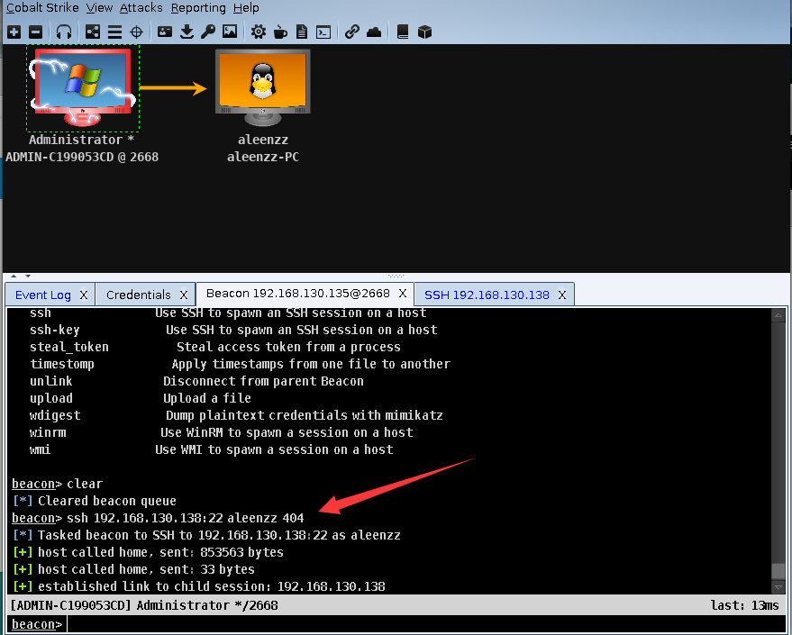

# 0x00 ssh登陆

当内网有Linux时 Cobalt Strike也是考虑到的提供了ssh连接,只需要用目标机的beacon去连接就可以了。

1. 密码直接连接

```
beacon> help ssh
Use: ssh [target:port] [user] [pass]

Spawn an SSH client and attempt to login to the specified target

```

2. ssh-key

```
beacon> help ssh-key
Use: ssh [target:port] [user] [/path/to/key.pem]

Spawn an SSH client and attempt to login to the specified target

```

我这里就直接用密码登陆了 



# 0x01 ssh beacon


```
ssh> help

SSH Commands
============

    Command                   Description
    -------                   -----------
    cancel                    Cancel a download that's in-progress
    cd                        Change directory
    clear                     Clear task queue
    download                  Download a file
    downloads                 Lists file downloads in progress
    exit                      Terminate this session
    help                      Help menu
    note                      Assign a note to this session       
    pwd                       Print current directory
    rportfwd                  Setup a reverse port forward
    shell                     Execute a command via the shell
    sleep                     Set parent beacon's sleep time
    socks                     Start SOCKS4a server to relay traffic
    socks stop                Stop SOCKS4a server
    sudo                      Run a command via sudo
    upload                    Upload a file

```


SSH beacon的功能较少，执行shell命令也是 `shell ls -al` 

# 0x02 文末


### 本文如有错误，请及时提醒，以免误导他人


