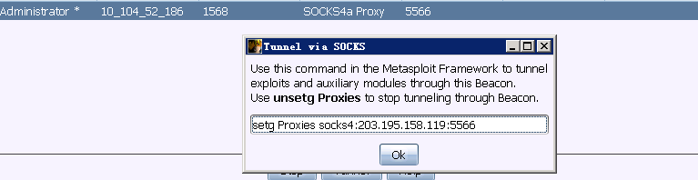
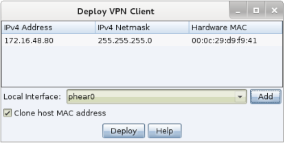
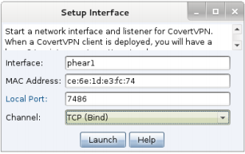

# 0x00 端口转发
虽然他是集成在CS里面的工具 但是速度很慢，很不问题建议还是使用其他成熟的工具ew之类的。
这里就做个介绍

```
beacon> help rportfwd
Use: rportfwd [bind port] [forward host] [forward port]
     rportfwd stop [bind port]

Binds the specified port on the target host. When a connection comes in,
Cobalt Strike will make a connection to the forwarded host/port and use Beacon
to relay traffic between the two connections.
```

>rportfwd 本机端口  目标ip 目标端口

然后本地使用 就是本机ip+本机端口 

# 0x01 socks4

通过这些SOCKS服务器的所有连接都将变为连接，读取，写入和关闭任务状态，以便执行相关的Beacon。您可以通过SOCKS的任何类型的Beacon进行隧道传输。
Beacon的HTTP数据通道对数据转发的响应最快，如果您想通过DNS转发流量，请使用DNS TXT记录通信模式。
CS本身支持的是socks4代理，貌似有脚本支持socks5，他有2种用法，一种是配合proxychains带入目标内网 ，一种是直接把msf带入目标内网

```
beacon> help socks
Use: socks [stop|port]

Starts a SOCKS4a server on the specified port. This server will relay 
connections through this Beacon. 

Use socks stop to stop the SOCKS4a server and terminate existing connections.

Traffic will not relay while Beacon is asleep. Change the sleep time with the
sleep command to reduce latency.
```
然后用proxychains 配合工具

```
vi /etc/proxychains.conf	
socks4 xxx.xxx.xxx.xx 5566
```

配合msf 找到view >proxy pivots


然后打开msf 设置即可


msf 中 unsetg Proxies来停止此执行

# 0x02 Covert VPN
### 部署Covert VPN
要激活Covert VPN，右键单击受控的主机， Pivoting - > Deploy VPN。选择您希望Covert VPN绑定到的远程接口。如果没有本地接口，请选择Add来创建。


>clone host mac address

检查克隆主机MAC地址，使本地接口与远程接口具有相同的MAC地址。
选择Deploy在目标上启动Covert VPN客户端。Covert VPN需要管理员访问才能部署。
一旦Covert VPN接口被激活，您就可以像使用系统上的任何物理接口一样使用它。使用ifconfig配置其IP地址。如果目标网络具有DHCP服务器，则可以使用操作系统的内置工具从该服务器请求IP地址

### 管理接口
要管理您的Covert VPN接口，请进入到Cobalt Strike - > Interfaces。在这里，Cobalt Strike将显示Covert VPN接口，它们的配置方式以及通过每个接口传输和接收的字节数。突出显示一个接口，然后选择“Remove”清除该接口并关闭远程Covert VPN客户端。。Covert VPN将在重新启动时删除其临时文件，并立即自动撤消任何系统更改。

选择Add 以配置新的Covert VPN接口。

### 配置接口
Covert VPN接口包括一个网路分流器(Network Tap)和一个通过以太网帧进行通信的通道。要配置接口，请选择接口名称（这是稍后通过ifconfig操作的内容）和MAC地址。



### VPN接口设置
您还必须为您的接口配置Covert VPN通信通道。Covert VPN可以通过UDP连接、TCP连接，ICMP或使用HTTP协议来通信以太网帧。TCP（反向）通道的目标连接到Cobalt Strike实例。TCP（Bind）通道通过Beacon具有Cobalt Strike隧道VPN。
Cobalt Strike将根据您选择的本地端口和通道设置和管理与Covert VPN客户端的通信。
Covert VPN HTTP通道使用Cobalt Strike Web服务器。您可以在同一端口上托管其他Cobalt Strike Web应用程序和多个Covert VPN HTTP通道。
为获得最佳性能，请使用UDP通道。与TCP和HTTP通道相比，UDP通道的消耗最小。如果需要通过防火墙，请使用ICMP，HTTP或TCP（Bind）通道。

注意：此功能在Windows 10目标上不起作用。

# 0x02 文末
有些文章可能看起来有点水，其中很多引用了官方文档，这样写方便查阅。


### 本文如有错误，请及时提醒，以免误导他人