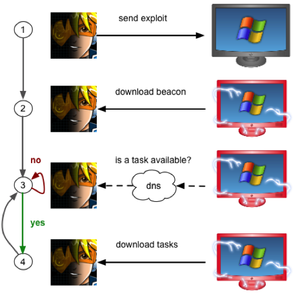
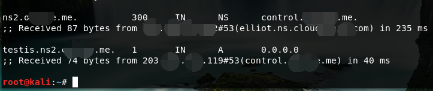
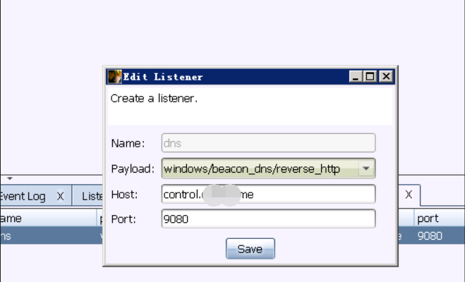
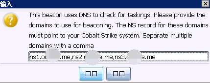
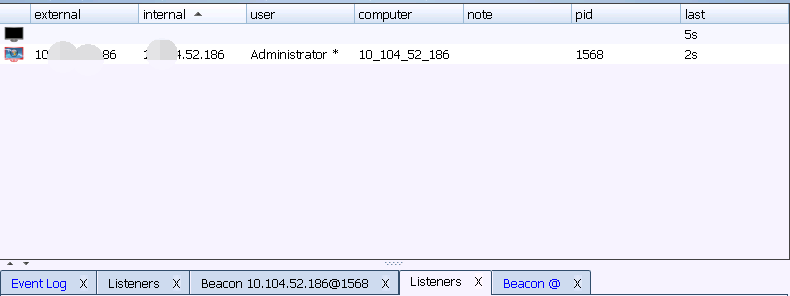

# 0x00 简介
DNS Beacon 在绕过防火墙 权限维持上非常有效，DNS beacon http 是最受欢迎的Cobalt Strike功能。
其中原理示意图

当然你如果想很清楚知道这个过程，建议看看DNS的解析过程。

#0x01 DNS Beacon

使用DNS Beacon首先的有一个域名，域名建议用国外的，省去一些不必要的麻烦，域名使用一些通用平常的即可，整个过程配置非常简单一条A记录和几条NS记录

>A记录指向服务器ip >ns记录都指向A记录域名

这里我用的一个国内平台解析做的演示，后面用的A11大佬的域名了

配置好了我们可以用 nslookup 或者 dig +trace 来测试下 是否成功

nslookup 
>要测试DNS配置，请打开终端并键入nslookup jibberish.beacon.domain。如果您获得0.0.0.0的A记录回复 - 那么您的DNS设置正确。如果您没有收到回复，那么您的DNS配置不正确，混合HTTP和DNS信标将无法与您通信

dig +trace 
>dig +trace testis.ns2.xxxxx.me

可以看到它通过ns记录 找到了我们的服务器ip ，成功后我们就可以配置我们的监听器了

这里最好填域名 也就是A记录

然后确定填上ns记录 英文逗号隔开 ，然后生成马儿测试效果

当点击后会出现一个类似黑屏的logo 然后就是漫长的等待它上线了。 

# 0x02 文末

咳咳 身体才是革命的本钱，这篇文章时隔一周才写 ，还是那句话 多喝热水（半小时）

### 本文如有错误，请及时提醒，以免误导他人
